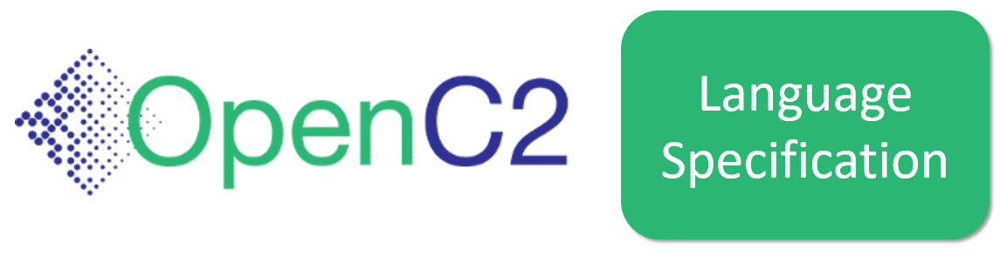
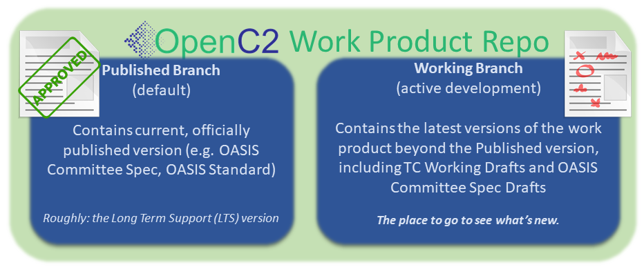

##  An OASIS [Work Product](https://www.oasis-open.org/policies-guidelines/oasis-defined-terms-2018-05-22/#dWorkProduct) Repository  

Members of the OASIS [Open Command and Control (OpenC2) Technical
Committee](https://www.oasis-open.org/committees/tc_home.php?wg_abbrev=openc2)
use this GitHub repository as part of the [TC's chartered
work](https://www.oasis-open.org/committees/openc2/charter.php).
Contributors must be Members of the TC. Work is governed by the
OASIS policies and is not done under typical open source
licensing. For more details, see the
[Contributions](#contributions) and [Licensing](#licensing)
sections below. 

## :blue_book: _Open Command and Control (OpenC2) Language Specification_ :blue_book:

This repository supports the [OpenC2
TC's](https://www.oasis-open.org/committees/tc_home.php?wg_abbrev=openc2)
work to define the elements of Open Command and Control (OpenC2)
language and the mechanisms for extending it.

### :twisted_rightwards_arrows: Repository Organization :twisted_rightwards_arrows:

OpenC2 work product repositories are organized a bit differently
than typical open source software project repositories:

* The **Published** (default) branch represents the current,
  stable, approved version of the work product. If the product
  hasn't progressed past an [OASIS Committee Specification Draft
  (CSD)](https://www.oasis-open.org/policies-guidelines/tc-process-2017-05-26/#committeeDraft),
  this branch is essentially empty
* The **Working** branch is where all work-in-progress content is
  captured, and is the place to go for the [current working
  version](https://github.com/dlemire60/openc2-oc2ls/blob/working/oc2ls.md)
  of this work product

More information about the TC's repository organizing conventions
and branching strategy can be found in our [Documentation
Norms](https://github.com/oasis-tcs/openc2-tc-ops/blob/main/Documentation-Norms.md#433-configure-repository).

###  :left_speech_bubble: Description  :left_speech_bubble:

Cyberattacks are increasingly sophisticated, less expensive to
execute, dynamic and automated. The provision of cyber defense
via statically configured products operating in isolation is
untenable. Standardized interfaces, protocols and data models
will facilitate the integration of the functional blocks within a
system and between systems. 

**Open Command and Control (OpenC2)** is a concise and extensible
language to enable machine-to-machine communications for purposes
of command and control of cyber defense components, subsystems
and/or systems in a manner that is agnostic of the underlying
products, technologies, transport mechanisms or other aspects of
the implementation. It should be understood that a language such
as OpenC2 is necessary but insufficient to enable coordinated
cyber responses that occur within cyber relevant time. Other
aspects of coordinated cyber response such as sensing, analytics,
and selecting appropriate courses of action are beyond the scope
of OpenC2.

###  :writing_hand: Contributions  :writing_hand:

As stated in this repository's
[CONTRIBUTING](https://github.com/oasis-tcs/openc2-oc2ls/blob/published/CONTRIBUTING.md)
file, contributors to this repository must be Members of the
OASIS [OpenC2
TC](https://www.oasis-open.org/committees/tc_home.php?wg_abbrev=openc2)
for any substantive contributions or change requests.  Anyone
wishing to contribute to this GitHub project and
[participate](https://www.oasis-open.org/join/participation-instructions)
in the TC's technical activity is invited to join as an OASIS TC
Member. Public feedback is also accepted, subject to the terms of
the [OASIS Feedback
License](https://www.oasis-open.org/policies-guidelines/ipr#appendixa). 

###  :scroll: Licensing  :scroll:

Please see the
[LICENSE](https://github.com/oasis-tcs/openc2-oc2ls/blob/published/LICENSE.md)
file for description of the license terms and OASIS policies
applicable to the TC's work in this GitHub project. Content in
this repository is intended to be part of the OpenC2 TC's
permanent record of activity, visible and freely available for
all to use, subject to applicable OASIS policies, as presented in
the repository
[LICENSE](https://github.com/oasis-tcs/openc2-oc2ls/blob/published/LICENSE.md). 

### :envelope_with_arrow: Contact :envelope_with_arrow:

Please send questions or comments about [OASIS TC GitHub
repositories](https://www.oasis-open.org/resources/tcadmin/github-repositories-for-oasis-tc-members-chartered-work)
to the [OASIS TC Administrator](mailto:tc-admin@oasis-open.org).
For questions about content in this repository, please contact
the TC Chair or Co-Chairs as listed on the the OpenC2 TC's [home
page](https://www.oasis-open.org/committees/openc2/).
