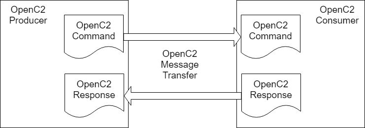

-------

# Open Command and Control (OpenC2) Language Specification Version 1.0
## Working Draft 08
## 05 October 2018
**Specification URIs**

**This version:**

* oasis-to-fill-in-link.md (Authoritative)
* oasis-to-fill-in-link.pdf
* oasis-to-fill-in-link.html

**Previous Version:**

* [http://docs.oasis-open.org/openc2/oc2ls/v1.0/csd04/md/oc2ls-v1.0-wd06.md](http://docs.oasis-open.org/openc2/oc2ls/v1.0/csd04/md/oc2ls-v1.0-wd06.md) (Authoritative)
* [http://docs.oasis-open.org/openc2/oc2ls/v1.0/csd04/oc2ls-v1.0-csd04.pdf](http://docs.oasis-open.org/openc2/oc2ls/v1.0/csd04/oc2ls-v1.0-csd04.pdf)
* [http://docs.oasis-open.org/openc2/oc2ls/v1.0/csd04/oc2ls-v1.0-csd04.html](http://docs.oasis-open.org/openc2/oc2ls/v1.0/csd04/oc2ls-v1.0-csd04.html)

**Technical Committee:**

* [OASIS Open Command and Control (OpenC2) TC](https://www.oasis-open.org/committees/tc_home.php?wg_abbrev=openc2)

**Chairs**

* Joe Brule (jmbrule@nsa.gov), National Security Agency
* Sounil Yu (sounil.yu@bankofamerica.com), Bank of America

**Editors**

* Jason Romano (jdroman@nsa.gov), National Security Agency
* Duncan Sparrell (duncan@sfractal.com), sFractal Consulting

## Abstract
Cyberattacks are increasingly sophisticated, less expensive to execute, dynamic and automated. The provision of cyberdefense via statically configured products operating in isolation is no longer tenable. Standardized interfaces, protocols and data models will facilitate the integration of the functional blocks within a system and between systems. Open Command and Control (OpenC2) is a concise and extensible language to enable the command and control of cyber defense components, subsystems and/or systems in a manner that is agnostic of the underlying products, technologies, transport mechanisms or other aspects of the implementation. It should be understood that a language such as OpenC2 is necessary but insufficient to enable coordinated cyber response. Other aspects of coordinated cyber response such as sensing, analytics, and selecting appropriate courses of action are beyond the scope of OpenC2.

## Status
This document was last revised or approved by the OASIS Open Command and Control (OpenC2) TC on the above date. The level of approval is also listed above. Check the "Latest version" location noted above for possible later revisions of this document. Any other numbered Versions and other technical work produced by the Technical Committee (TC) are listed at [https://www.oasis-open.org/committees/tc_home.php?wg_abbrev=openc2#technical](https://www.oasis-open.org/committees/tc_home.php?wg_abbrev=openc2#technical).

TC members should send comments on this specification to the TC's email list. Others should send comments to the TC's public comment list, after subscribing to it by following the instructions at the "Send A Comment" button on the TC's web page at [https://www.oasis-open.org/committees/openc2/](https://www.oasis-open.org/committees/openc2/).

This Draft is provided under the Non-Assertion Mode of the OASIS IPR Policy, the mode chosen when the Technical Committee was established. For information on whether any patents have been disclosed that may be essential to implementing this specification, and any offers of patent licensing terms, please refer to the Intellectual Property Rights section of the TC's web page ([https://www.oasis-open.org/committees/openc2/ipr.php](https://www.oasis-open.org/committees/openc2/ipr.php)).

Note that any machine-readable content (Computer Language Definitions) declared Normative for this Work Product is provided in separate plain text files. In the event of a discrepancy between any such plain text file and display content in the Work Product's prose narrative document(s), the content in the separate plain text file prevails.

### Citation format:
When referencing this specification the following citation format should be used:

**[OpenC2-Lang-v1.0]**

_Open Command and Control (OpenC2) Language Specification Version 1.0_. Edited by Jason Romano and Duncan Sparrell. 05 October 2018. OASIS Working Draft 08. oasis-to-fill-in-link.html.

Latest version: [http://docs.oasis-open.org/openc2/oc2ls/v1.0/oc2ls-v1.0.html](http://docs.oasis-open.org/openc2/oc2ls/v1.0/oc2ls-v1.0.html).

-------

## Notices
Copyright © OASIS Open 2018. All Rights Reserved.

All capitalized terms in the following text have the meanings assigned to them in the OASIS Intellectual Property Rights Policy (the "OASIS IPR Policy"). The full [Policy](https://www.oasis-open.org/policies-guidelines/ipr) may be found at the OASIS website.

This document and translations of it may be copied and furnished to others, and derivative works that comment on or otherwise explain it or assist in its implementation may be prepared, copied, published, and distributed, in whole or in part, without restriction of any kind, provided that the above copyright notice and this section are included on all such copies and derivative works. However, this document itself may not be modified in any way, including by removing the copyright notice or references to OASIS, except as needed for the purpose of developing any document or deliverable produced by an OASIS Technical Committee (in which case the rules applicable to copyrights, as set forth in the OASIS IPR Policy, must be followed) or as required to translate it into languages other than English.

The limited permissions granted above are perpetual and will not be revoked by OASIS or its successors or assigns.

This document and the information contained herein is provided on an "AS IS" basis and OASIS DISCLAIMS ALL WARRANTIES, EXPRESS OR IMPLIED, INCLUDING BUT NOT LIMITED TO ANY WARRANTY THAT THE USE OF THE INFORMATION HEREIN WILL NOT INFRINGE ANY OWNERSHIP RIGHTS OR ANY IMPLIED WARRANTIES OF MERCHANTABILITY OR FITNESS FOR A PARTICULAR PURPOSE.

OASIS requests that any OASIS Party or any other party that believes it has patent claims that would necessarily be infringed by implementations of this OASIS Committee Specification or OASIS Standard, to notify OASIS TC Administrator and provide an indication of its willingness to grant patent licenses to such patent claims in a manner consistent with the IPR Mode of the OASIS Technical Committee that produced this specification.

OASIS invites any party to contact the OASIS TC Administrator if it is aware of a claim of ownership of any patent claims that would necessarily be infringed by implementations of this specification by a patent holder that is not willing to provide a license to such patent claims in a manner consistent with the IPR Mode of the OASIS Technical Committee that produced this specification. OASIS may include such claims on its website, but disclaims any obligation to do so.

OASIS takes no position regarding the validity or scope of any intellectual property or other rights that might be claimed to pertain to the implementation or use of the technology described in this document or the extent to which any license under such rights might or might not be available; neither does it represent that it has made any effort to identify any such rights. Information on OASIS' procedures with respect to rights in any document or deliverable produced by an OASIS Technical Committee can be found on the OASIS website. Copies of claims of rights made available for publication and any assurances of licenses to be made available, or the result of an attempt made to obtain a general license or permission for the use of such proprietary rights by implementers or users of this OASIS Committee Specification or OASIS Standard, can be obtained from the OASIS TC Administrator. OASIS makes no representation that any information or list of intellectual property rights will at any time be complete, or that any claims in such list are, in fact, Essential Claims.

The name "OASIS" is a trademark of [OASIS](https://www.oasis-open.org/), the owner and developer of this specification, and should be used only to refer to the organization and its official outputs. OASIS welcomes reference to, and implementation and use of, specifications, while reserving the right to enforce its marks against misleading uses. Please see [https://www.oasis-open.org/policies-guidelines/trademark](https://www.oasis-open.org/policies-guidelines/trademark) for above guidance.

-------

# Table of Contents
[[TOC]]

-------

# 1 Introduction
OpenC2 is a suite of specifications that enables command and control of cyber defense systems and components.  OpenC2 typically uses a request-response paradigm where a command is encoded by an OpenC2 producer (managing application) and transferred to an OpenC2 consumer (managed device or virtualized function) using a secure transport protocol, and the consumer can respond with status and any requested information.  The contents of both the command and the response are fully described in schemas, allowing both parties to recognize the syntax constraints imposed on the exchange.

OpenC2 allows the application producing the commands to discover the set of capabilities supported by the managed devices.  These capabilities permit the managing application to adjust its behavior to take advantage of the features exposed by the managed device.  The capability definitions can be easily extended in a noncentralized manner, allowing standard and non-standard capabilities to be defined with semantic and syntactic rigor.

## 1.1 IPR Policy
This Working Draft is being developed under the [Non-Assertion](https://www.oasis-open.org/policies-guidelines/ipr#Non-Assertion-Mode) Mode of the [OASIS IPR Policy](https://www.oasis-open.org/policies-guidelines/ipr), the mode chosen when the Technical Committee was established. For information on whether any patents have been disclosed that may be essential to implementing this specification, and any offers of patent licensing terms, please refer to the Intellectual Property Rights section of the TC's web page ([https://www.oasis-open.org/committees/openc2/ipr.php](https://www.oasis-open.org/committees/openc2/ipr.php)).

## 1.2 Terminology
* **Action**: The task or activity to be performed.
* **Actuator**: The entity that performs the action.
* **Command**: A message defined by an action-target pair that is sent from a producer and received by a consumer.
* **Consumer**: A managed device / application that receives Commands.  Note that a single device / application can have both consumer and producer capabilities.
* **Producer**: A manager application that sends Commands.
* **Response**: A message from a consumer to a producer acknowledging a command or returning the requested resources or status to a previously received request.
* **Target**: The object of the action, i.e., the action is performed on the target.

The key words "MUST", "MUST NOT", "REQUIRED", "SHALL", "SHALL NOT", "SHOULD", "SHOULD NOT", "RECOMMENDED", "MAY", and "OPTIONAL" in this document are to be interpreted as described in [RFC2119] and [RFC8174].

## 1.3 Normative References
|   |   |
| :--- | :--- |
| **[OpenC2-HTTPS-v1.0]** | _Specification for Transfer of OpenC2 Messages via HTTPS Version 1.0_. Edited by David Lemire. 09 August 2018. OASIS Working Draft 02. [http://docs.oasis-open.org/openc2/open-impl-https/v1.0/csd01/open-impl-https-v1.0-csd01.html](http://docs.oasis-open.org/openc2/open-impl-https/v1.0/csd01/open-impl-https-v1.0-csd01.html). <br>Latest version: [http://docs.oasis-open.org/openc2/open-impl-https/v1.0/open-impl-https-v1.0.html](http://docs.oasis-open.org/openc2/open-impl-https/v1.0/open-impl-https-v1.0.html). |
| **[OpenC2-SLPF-v1.0]** | _Open Command and Control (OpenC2) Profile for Stateless Packet Filtering Version 1.0_. Edited by Joe Brule, Duncan Sparrell, and Alex Everett. 19 September 2018. OASIS Working Draft 04. oasis-to-fill-in-link.html. <br>Latest version: http://docs.oasis-open.org/openc2/oc2slpf/v1.0/oc2slpf-v1.0.html  |
| **[RFC768]** | Postel, J., "User Datagram Protocol", STD 6, RFC 768, August 1980, http://www.rfc-editor.org/info/rfc768. |
| **[RFC792]** | Postel, J., "Internet Control Message Protocol", STD 5, RFC 792, September 1981, http://www.rfc-editor.org/info/rfc792. |
| **[RFC793]** | Postel, J., "Transmission Control Protocol", STD 7, RFC 793, September 1981, http://www.rfc-editor.org/info/rfc793. |
| **[RFC1034]** | Mockapetris, P. V., "Domain names - concepts and facilities", STD 13, RFC 1034, November 1987, http://www.rfc-editor.org/info/rfc1034. |
| **[RFC1123]** | Braden, R., "Requirements for Internet Hosts - Application and Support", STD 3, RFC 1123, October 1989, http://www.rfc-editor.org/info/rfc1123. |
| **[RFC1321]** | Rivest, R., "The MD5 Message-Digest Algorithm", RFC 1321, April 1992, http://www.rfc-editor.org/info/rfc1321. |
| **[RFC2119]** | Bradner, S., "Key words for use in RFCs to Indicate Requirement Levels", BCP 14, RFC 2119, DOI 10.17487/RFC2119, March 1997, http://www.rfc-editor.org/info/rfc2119. |
| **[RFC3986]** | Berners-Lee, T., Fielding, R., Masinter, L., "Uniform Resource Identifier (URI): Generic Syntax", STD 66, RFC 3986, January 2005, http://www.rfc-editor.org/info/rfc3986. |
| **[RFC4122]** | Leach, P., Mealling, M., Salz, R., "A Universally Unique IDentifier (UUID) URN Namespace", RFC 4122, July 2005, http://www.rfc-editor.org/info/rfc4122. |
| **[RFC4648]** | Josefsson, S., "The Base16, Base32, and Base64 Data Encodings", RFC 4648, October 2006, http://www.rfc-editor.org/info/rfc4648. |
| **[RFC4960]** | Stewart, R. "Stream Control Transmission Protocol", RFC 4960, September 2007, http://www.rfc-editor.org/info/rfc4960. |
| **[RFC5237]** | Arkko, J., Bradner, S., "IANA Allocation Guidelines for the Protocol Field", BCP 37, RFC 5237, February 2008, http://www.rfc-editor.org/info/rfc5237. |
| **[RFC5322]** | Resnick, P., "Internet Message Format", RFC 5322, October 2008, http://www.rfc-editor.org/info/rfc5322. |
| **[RFC5612]** | Eronen, P., Harrington, D., "Enterprise Number for Documentation Use", RFC 5612, August 2009, http://www.rfc-editor.org/info/rfc5612. |
| **[RFC6234]** | Eastlake 3rd, D., Hansen, T., "US Secure Hash Algorithms (SHA and SHA-based HMAC and HKDF)", RFC 6234, May 2011, http://www.rfc-editor.org/info/rfc6234. |
| **[RFC6335]** | Cotton, M., Eggert, L., Touch, J., Westerlund, M., Cheshire, S., "Internet Assigned Numbers Authority (IANA) Procedures for the Management of the Service Name and Transport Protocol Port Number Registry", BCP 165, RFC 6335, August 2011, http://www.rfc-editor.org/info/rfc6335. |
| **[RFC6838]** | Freed, N., Klensin, J., Hansen, T., "Media Type Specifications and Registration Procedures, BCP 13, RFC 6838, January 2013, http://www.rfc-editor.org/info/rfc6838. |
| **[RFC7493]** | Bray, T., "The I-JSON Message Format", RFC 7493, March 2015, http://www.rfc-editor.org/info/rfc7493. |
| **[RFC8174]** | Leiba, B., "Ambiguity of Uppercase vs Lowercase in RFC 2119 Key Words", BCP 14, RFC 8174, DOI 10.17487/RFC8174, May 2017, http://www.rfc-editor.org/info/rfc8174. |
| **[RFC8259]** | Bray, T., "The JavaScript Object Notation (JSON) Data Interchange Format", STD 90, RFC 8259, December 2017, http://www.rfc-editor.org/info/rfc8259. |

## 1.4 Non-Normative References
|   |   |
| :--- | :--- |
| **[IACD]** | [Full reference citation] |

## 1.5 Document Conventions
### 1.5.1 Naming Conventions
* RFC2119/RFC8174 key words (see section 1.4) are in all uppercase.
* All property names and literals are in lowercase, except when referencing canonical names defined in another standard (e.g., literal values from an IANA registry).
* All words in structure component names are capitalized and are separated with a hyphen, e.g., ACTION, TARGET, TARGET-SPECIFIER.
* Words in property names are separated with an underscore (_), while words in string enumerations and type names are separated with a hyphen (-).
* The term "hyphen" used here refers to the ASCII hyphen or minus character, which in Unicode is "hyphen-minus", U+002D.
* All type names, property names, object names, and vocabulary terms are between three and 40 characters long.

### 1.5.2 Font Colors and Style
The following color, font and font style conventions are used in this document:

* A fixed width font is used for all type names, property names, and literals.
* Property names are in bold style – **`created_a**t`
* All examples in this document are expressed in JSON. They are in fixed width font, with straight quotes, black text and a light shaded background, and 4-space indentation. JSON examples in this document are representations of JSON Objects. They should not be interpreted as string literals. The ordering of object keys is insignificant. Whitespace before or after JSON structural characters in the examples are insignificant [[RFC8259](https://docs.google.com/document/d/1ShNq4c3e1CkfANmD9O--mdZ5H0O_GLnjN28a_yrEaco/edit#bookmark=id.mmt4e4p953r5)].
* Parts of the example may be omitted for conciseness and clarity. These omitted parts are denoted with the ellipses (...).

Example:

```javascript
{   
    "action": "contain",
    "target": {
        "user_account": {
            "user_id": "fjbloggs",
            "account_type": "windows-local"
        }
    }
}
```

## 1.6 Overview
OpenC2 is a set of specifications to command actuators that execute cyber defense functions.  These specifications include the OpenC2 Language Specification, Actuator Profiles, and Transfer Specifications.  The OpenC2 Language Specification and Actuator Profile(s) specifications focus on the standard at the producer and consumer of the command and response while the transfer specifications focus on the protocols for their exchange.

* The OpenC2 Language Specification provides the semantics for the essential elements of the language, the structure for commands and responses, and the schema that defines the proper syntax for the language elements that represents the command or response.
* OpenC2 Actuator Profiles specify the subset of the OpenC2 language relevant in the context of specific actuator functions. Cyber defense components, devices, systems and/or instances may (in fact are likely) to implement multiple actuator profiles.  Actuator profiles extend the language by defining specifiers that identify the actuator to the required level of precision and may define command arguments that are relevant and/or unique to those actuator functions.
* OpenC2 Transfer Specifications utilize existing protocols and standards to implement OpenC2 in specific environments. These standards are used for communications and security functions beyond the scope of the language, such as message transfer encoding, authentication, and end-to-end transport of OpenC2 messages.

The OpenC2 Language Specification defines a language used to compose messages for command and control of cyber defense systems and components.  A message consists of a header and a payload (_defined_ as a message body in the OpenC2 Language Specification Version 1.0 and _specified_ in one or more actuator profiles). 

In general, there are two types of participants involved in the exchange of OpenC2 messages, as depicted in Figure 1-1:

1. **OpenC2 Producers**: An OpenC2 Producer is an entity that creates commands to provide instruction to one or more systems to act in accordance with the content of the command. An OpenC2 Producer may receive and process responses in conjunction with a command.
2. **OpenC2 Consumers**: An OpenC2 Consumer is an entity that receives and may act upon an OpenC2 command.  An OpenC2 Consumer may create responses that provide any information captured or necessary to send back to the OpenC2 Producer. 

The language defines two payload structures:

1. **Command**: An instruction from one system known as the OpenC2 "Producer", to one or more systems, the OpenC2 "Consumer(s)", to act on the content of the command.
2. **Response**: Any information captured or necessary to send back to the OpenC2 Producer  that issued the Command, i.e., the OpenC2 Consumer’s response to the OpenC2 Producer.



**Figure 1-1. OpenC2 Message Exchange**

OpenC2 implementations integrate the related OpenC2 specifications described above with related industry specifications, protocols, and standards. Figure 1 depicts the relationships among OpenC2 specifications, and their relationships to other industry standards and environment-specific implementations of OpenC2. Note that the layering of implementation aspects in the diagram is notional, and not intended to preclude, e.g., the use of an application-layer message signature function to provide message source authentication and integrity. 


**Figure 1-2. OpenC2 Documentation and Layering Model**

OpenC2 is conceptually partitioned into four layers as shown in Table 1-1.

**Table 1-1. OpenC2 Protocol Layers**

| Layer | Examples |
| :--- | :--- |
| Function-Specific Content | Actuator Profiles
(standard and extensions) |
| Common Content | Language Specification
(this document) |
| Message | Transfer Specifications<br>(OpenC2-over-HTTPS, OpenC2-over-CoAP, …) |
| Secure Transport | HTTPS, CoAP, MQTT, OpenDXL, ... |

* The **Secure Transport** layer provides a communication path between the producer and the consumer.  OpenC2 can be layered over any standard transport protocol.
* The **Message** layer provides a transport- and content-independent mechanism for conveying requests, responses, and notifications.  A transfer specification maps transport-specific protocol elements to a transport-independent set of message elements consisting of content and associated metadata.  
* The **Common Content** layer defines the structure of OpenC2 commands and responses and a set of common language elements used to construct them.
* The **Function-specific Content** layer defines the language elements used to support a particular cyber defense function.  An actuator profile defines the implementation conformance requirements for that function.  OpenC2 Producers and Consumers will support one or more profiles.

The components of an OpenC2 Command are an action (what is to be done), a target (what is being acted upon), an optional actuator (what is performing the command), and command arguments, which influence how the command is to be performed. An action coupled with a target is sufficient to describe a complete OpenC2 Command. Though optional, the inclusion of an actuator and/or command arguments provides additional precision to a command, when needed.

The components of an OpenC2 Response are a numerical status code, an optional status text string, and optional results. The format of the results, if included, depend on the type or response being transferred. 

## 1.7 Goal
The goal of the OpenC2 Language Specification is to provide a language for interoperating between functional elements of cyber defense systems. This language used in conjunction with OpenC2 Actuator Profiles and OpenC2 Transfer Specifications allows for vendor-agnostic cybertime response to attacks.

The Integrated Adaptive Cyber Defense (IACD) framework defines a collection of activities, based on the traditional OODA (Observe–Orient–Decide–Act) Loop [IACD]:

* Sensing:  gathering of data regarding system activities
* Sense Making:  evaluating data using analytics to understand what's happening
* Decision Making:  determining a course-of-action to respond to system events
* Acting:  Executing the course-of-action 

The goal of OpenC2 is to enable coordinated defense in cyber-relevant time between decoupled blocks that perform cyber defense functions.  OpenC2 focuses on the Acting portion of the IACD framework; the assumption that underlies the design of OpenC2 is that the sensing/ analytics have been provisioned and the decision to act has been made. This goal and these assumptions guides the design of OpenC2:

* **Technology Agnostic:**  The OpenC2 language defines a set of abstract atomic cyber defense actions in a platform and product agnostic manner
* **Concise:**  An OpenC2 command is intended to convey only the essential information required to describe the action required and can be represented in a very compact form for communications-constrained environments
* **Abstract:**  OpenC2 commands and responses are defined abstractly and can be encoded and transferred via multiple schemes as dictated by the needs of different implementation environments
* **Extensible:**  While OpenC2 defines a core set of actions and targets for cyber defense, the language is expected to evolve with cyber defense technologies, and permits extensions to accommodate new cyber defense technologies.

## 1.8 Purpose and Scope
The OpenC2 Language Specification defines the set of components to assemble a complete command and control message and provides a framework so that the language can be extended. To achieve this purpose, the scope of this specification includes:

1. the set of actions and options that may be used in OpenC2 commands
2. the set of targets and target specifiers
3. a syntax that defines the structure of commands and responses
4. the mandatory-to-implement (MTI) serialization of OpenC2 commands, and responses
5. the procedures for extending the language

The OpenC2 language assumes that the event has been detected, a decision to act has been made, the act is warranted, and the initiator and recipient of the commands are authenticated and authorized. The OpenC2 language was designed to be agnostic of the other aspects of cyber defense implementations that realize these assumptions. The following items are beyond the scope of this specification:

1. Language extensions applicable to some actuators, which may be defined in individual actuator profiles.
2. Alternate serializations of OpenC2 commands.
3. The enumeration of the protocols required for transport, information assurance, sensing, analytics and other external dependencies.

# 2 OpenC2 Language Description
The OpenC2 language has two distinct content types: command and response. The command is sent from a producer to a consumer and describes an action to be performed by an actuator on a target. The response is sent from a consumer, usually back to the producer, and is a means to provide information (such as acknowledgement, status, etc.) as a result of a command.

## 2.1 OpenC2 Command
The command describes an action to be performed on a target and may include information identifying the actuator or actuators that are to execute the command. 

A command has four main components: ACTION, TARGET, ARGUMENTS, and ACTUATOR. The following list summarizes the components of a command. 

* **ACTION** (required): The task or activity to be performed.
* **TARGET** (required): The object of the action. The ACTION is performed on the target.
    * **TARGET-NAME** (required): The name of the object of the action.
    * **TARGET-SPECIFIERS** (optional): The specifier further identifies the target to some level of precision, such as a specific target, a list of targets, or a class of targets.
* **ARGUMENTS** (optional): Provide additional information on how the command is to be performed, such as date/time, periodicity, duration etc.
* **ACTUATOR** (optional): The ACTUATOR executes the command (the ACTION and TARGET). The ACTUATOR type will be defined within the context of an Actuator Profile.
    * **ACTUATOR-NAME** (required): The name of the set of functions (e.g., "slpf") performed by the actuator, and the name of the profile defining commands applicable to those functions.
    * **ACTUATOR-SPECIFIERS** (optional): The specifier identifies the actuator to some level of precision, such as a specific actuator, a list of actuators, or a group of actuators.

The ACTION and TARGET components are required and are populated by one of the actions in [Section 3.3.1.1](#heading=h.fgpzeiwrbrt8) and the targets in [Section 3.3.1.2](#heading=h.mjtczoggleyu). A particular target may be further refined by one or more TARGET-SPECIFIERS. Procedures to extend the targets are described in [Section 3.3.4](#heading=h.uaduotfdxeoo).

TARGET-SPECIFIERS provide additional precision to identify the target (e.g., 10.1.2.3) and may include a method of identifying multiple targets of the same type (e.g., 10.1.0.0/16).

The ARGUMENTS component, if present, is populated by one or more 'command arguments' that determine how the command is executed. ARGUMENTS influence the command by providing information such as time, periodicity, duration, or other details on what is to be executed. They can also be used to convey the need for acknowledgement or additional status information about the execution of a command. The valid ARGUMENTS defined in this specification are in [Section 3.3.1.4](#heading=h.yd6fpfkpyn58).

An ACTUATOR is an implementation of a cyber defense function that executes the command. An Actuator Profile is a specification that identifies the subset of ACTIONS, TARGETS and other aspects of this language specification that are mandatory to implement or optional in the context of a particular ACTUATOR. An Actuator Profile also extends the language by defining additional ARGUMENTS and ACTUATOR-SPECIFIERS that are meaningful and possibly unique to the actuator.

The ACTUATOR optionally identifies the entity or entities that are tasked to execute the command. Specifiers for actuators refine the command so that a particular function, system, class of devices, or specific device can be identified. 

The ACTUATOR component may be omitted from a command and typically will not be included in implementations where the identities of the endpoints are unambiguous or when a high-level effects-based command is desired and the tactical decisions on how the effect is achieved is left to the recipient.  

## 2.2 OpenC2 Response
The OpenC2 Response is a message sent from the recipient of a command. Response messages provide acknowledgement, status, results from a query, or other information.

The following list summarizes the fields and subfields of an OpenC2 Response. 

* **STATUS** (required): An integer containing a numerical status code
* **STATUS_TEXT** (optional): A free-form string containing human-readable description of the response status. The string can contain more detail than is represented by the status code, but does not affect the meaning of the response.
* **RESULTS** (optional): Contains the data or extended status code that was requested from an OpenC2 Command. 

# 3 OpenC2 Language Definition 
## 3.1 Base Components and Structures
### 3.1.1 Data Types
The syntax of valid OpenC2 messages is defined using an information model constructed from the data types presented here:

| Type | Description |
| :--- | :--- |
| **Primitive Types** |   |
| Binary | A sequence of octets or bytes. |
| Boolean | A logical entity that can have two values: `true` and `false`. |
| Integer | A number that can be written without a fractional component. |
| Number | A real number. |
| Null | Nothing, used to designate fields with no value. |
| String | A sequence of characters. Each character must have a valid Unicode codepoint. |
| **Structures** |   |
| Array | An ordered list of unnamed fields. Each field has an ordinal position and a type. |
| ArrayOf | An ordered list of unnamed fields of the same type. Each field has an ordinal position and must be the specified type. |
| Choice | One field selected from a set of named fields. The value has a name and a type. |
| Enumerated | A set of id:name pairs where id is an integer. The Enumerated.ID subtype is a set of ids. |
| Map | An unordered set of named fields. Each field has an id, name and type. |
| Record | An ordered list of named fields, e.g. a message, record, structure, or row in a table. Each field has an ordinal position, a name, and a type. |

### 3.1.2 Derived Data Types
The following types are defined as value constraints applied to String (text string), Binary (octet string) or Integer values.  The serialized representation of these types is specified in [Section 3.1.5](#heading=h.1s7wa079dayl), but there are no restrictions on how these types are handled internally by an implementation. 

| Type | Base | Description |
| :--- | :--- | :--- |
| Domain-Name | String | RFC 1034 Section 3.5 |
| Date-Time | Integer | Milliseconds since 00:00:00 UTC, 1 January 1970. |
| Duration | Integer | Milliseconds. |
| Email-Addr | String | RFC 5322 Section 3.4.1 |
| Identifier | String | (TBD rules, e.g., initial alpha followed by alphanumeric or underscore) |
| IP-Addr | Binary | 32 bit IPv4 address or 128 bit IPv6 address |
| MAC-Addr | Binary | 48 bit Media Access Code / Extended Unique Identifier |
| Port | Integer | 16 bit RFC 6335 Transport Protocol Port Number |
| Request-Id | Binary | A value of up to 128 bits |
| URI | String | RFC 3986 |
| UUID | Binary | 128 bit Universal Unique Identifier, RFC 4122 Section 4 |

### 3.1.3 Cardinality
Property tables for types based on Array, Choice, Map and Record include a cardinality column (#) that specifies the minimum and maximum number of values of a field.  The most commonly used cardinalities are:

* 1	Required and not repeatable
* 0..1	Optional and not repeatable
* 1..n	Required and repeatable
* 0..n	Optional and repeatable

The cardinality column may also specify a range of sizes, e.g.,:

* 3..5	Required and repeatable with a minimum of 3 and maximum of 5 values

### 3.1.4 Derived Enumerations and Selectors
An Enumerated field may be derived from the fields of a Choice, Map or Record type by appending ".*" to the type name.

A Choice field within an Array, Map or Record type may reference the contents of another field within that type to select which element of the choice is present.  The selector (key) field can be either an explicitly defined Enumerated type or a derived Enumerated type. .  The Choice type can reference the selector field by appending ".&selector-name" to the type.  For example:

**Type Name: Example-sel**

Base Type: Record

| ID | Name | Type | # | Description |
| :--- | :--- | :--- | :--- | :--- |
| 1 | key | Target.* | 1 | Selector auto-generated from Choice |
| 2 | date | Date-Time | 1 | … other fields in this record |
| 3 | value | Target.&key | 1 | Type of value is selected by "key" field |

A message of the "Example-sel" type would look like:

```
{   
    "key": "ip_addr",
    "date": 1537392265000,
    "value": "zIQomw"
}
```

### 3.1.5 Serialization
OpenC2 is agnostic of any particular serialization; however, implementations MUST support JSON serialization in accordance with RFC 7493 and additional requirements specified in the following table.

**JSON Serialization Requirements:**

| OpenC2 Data Type | JSON Serialization Requirement |
| :--- | :--- |
| **Binary** | Base64url string as defined in Section 5 of RFC 4648. |
| **Integer** | Text string as described in [Section 3.1.5.2](#heading=h.rsvt22s6h7s1). |
| **Array** | JSON Array |
| **ArrayOf** | JSON Array |
| **Choice** | JSON Object |
| **Enumerated** | Either integer id or name string.  The Enumerated.ID subtype (section 3.1.6) is a set of unnamed integers. |
| **Map** | JSON Object. Map keys are serialized as either integer ids or name strings. Keys for the Map.ID subtype (section 3.1.6) are unnamed integer ids. |
| **Record** | JSON Object |

#### 3.1.5.1 ID and Name Serialization
Instances of Enumerated types and keys for Choice and Map types are serialized as ID values except when using serialization formats intended for human consumption, where Name strings are used instead.  Defining a type using ".ID" appended to the base type (e.g., Enumerated.ID, Map.ID) indicates that:

1. The type definition and API value uses only the ID.  There is no corresponding name string except as an optional part of the description.
2. Instances of Enumerated values and Choice/Map keys are serialized as IDs regardless of serialization format.

#### 3.1.5.2 Integer Serialization
For machine-to-machine serialization formats, integers are represented as binary data, e.g., 32 bits, 128 bits.   But for human-readable serialization formats (XML and JSON), integers are converted to strings.  For example, the JSON "number" type represents integers and real numbers as decimal strings without quotes, e.g., { "height": 68.2 }, and as noted in RFC 7493 Section 2.2, a sender cannot expect a receiver to treat an integer with an absolute value greater than 2^^53 as an exact value.

The default representation of Integer types in text serializations is the native integer type for that format, e.g., "number" for JSON.   Integer fields with a range larger than the IEEE 754 exact range (e.g., 64, 128, 2048 bit values) are indicated by appending ".<bit-size>" or ".*" to the type, e.g. Integer.64 or Integer.*.  All serializations ensure that large Integer types are transferred exactly, for example in the same manner as Binary types.  Integer values support arithmetic operations; Binary values are not intended for that purpose.

## 3.2 Message
As described in Section 1.1, this language specification and one or more actuator profiles define the content of OpenC2 commands and responses, while transfer specifications define the on-the-wire format of a message over specific secure transport protocols.  Transfer specifications are agnostic with regard to content, and content is agnostic with regard to transfer protocol.  This decoupling is accomplished by defining a standard message interface used to transfer any type of content over any transfer protocol.

A message is a content- and transport-independent set of elements conveyed between consumers and producers.  To ensure interoperability all transfer specifications must unambiguously define how the message elements in [Table 3-1](#bookmark=id.802piptnpnjy) are represented within the secure transport protocol. This does not imply that all message elements must be used in all messages.  Content, content_type, and msg_type are required, while other message elements are not required by this specification but may be required by other documents.

**Table 3-1. Common Message Elements**

| Name | Description |
| :--- | :--- |
| **content** | Message body as specified by content_type and msg_type. |
| **content_type** | String. Media Type that identifies the format of the content, including major version. Incompatible content formats must have different content_types.  Content_type "**openc2**" identifies content defined by OpenC2 language specification versions 1.x, i.e., all versions that are compatible with version 1.0. |
| **msg_type** | Enumerated. One of "**request**", "**response**", or "**notification**".  For the **openc2 **content_type the request content is an OpenC2-Command and the response content is an OpenC2-Response.  OpenC2 does not currently define any notification content. |
| **request_id** | Request-Id. A unique identifier value of up to 128 bits that is attached to request and response messages. This value is assigned by the sender and is copied unmodified into all responses to support  reference to a particular command, transaction or event chain. |
| **created** | Date-Time. Creation date/time of the content, the number of milliseconds since 00:00:00 UTC, 1 January 1970. |
| **from** | String. Authenticated identifier of the creator of or authority for execution of a message. |
| **to** | ArrayOf(String). Authenticated identifier(s) of the authorized recipient(s) of a message. |

Implementations may use environment variables, private APIs, data structures, class instances, pointers, or other mechanisms to represent messages within the local environment.  However the internal representation of a message does not affect interoperability and is therefore beyond the scope of OpenC2.  This means that the message content is a data structure in whatever form is used within an implementation, not a serialized representation of that structure.  Content is the input provided to a serializer or the output of a de-serializer.  Msg_type is a three-element enumeration whose protocol representation is defined in each transfer spec, for example as a string, an integer, or a two-bit field.  The internal form of enumerations, like content, does not affect interoperability and is therefore unspecified.

## 3.3 Content
The scope of this specification is to define the ACTION and TARGET portions of an OpenC2 command and the common portions of an OpenC2 response.  The properties of the OpenC2 command are defined in [Section 3.3.1](#heading=h.f3ahqel2q85i) and the properties of the response are defined in [Section 3.3.2](#heading=h.23b40yml0v2x).

In addition to the ACTION and TARGET, an OpenC2 command has an optional ACTUATOR. Other than identification of namespace identifier, the semantics associated with the ACTUATOR specifiers are beyond the scope of this specification.  The actuators and actuator-specific results contained in a response are specified in ‘Actuator Profile Specifications’ such as StateLess Packet Filtering Profile, Routing Profile etc.

### 3.3.1 OpenC2 Command
The OpenC2 Command describes an action performed on a target. 

**_Type: OpenC2-Command (Record)_**

| ID | Name | Type | # | Description |
| :--- | :--- | :--- | :--- | :--- |
| 1 | **action** | Action | 1 | The task or activity to be performed (i.e., the 'verb'). |
| 2 | **target** | Target | 1 | The object of the action. The action is performed on the target. |
| 3 | **args** | Args | 0..1 | Additional information that applies to the command. |
| 4 | **actuator** | Actuator | 0..1 | The subject of the action. The actuator executes the action on the target. |

#### 3.3.1.1 Action
**_Type: Action (Enumerated)_**

| ID | Name | Description |
| :--- | :--- | :--- |
| 1 | **scan** | Systematic examination of some aspect of the entity or its environment. |
| 2 | **locate** | Find an object physically, logically, functionally, or by organization. |
| 3 | **query** | Initiate a request for information. |
| 6 | **deny** | Prevent a certain event or action from completion, such as preventing a flow from reaching a destination or preventing access. |
| 7 | **contain** | Isolate a file, process, or entity so that it cannot modify or access assets or processes. |
| 8 | **allow** | Permit access to or execution of a target. |
| 9 | **start** | Initiate a process, application, system, or activity. |
| 10 | **stop** | Halt a system or end an activity. |
| 11 | **restart** | Stop then start a system or an activity. |
| 14 | **cancel** | Invalidate a previously issued action. |
| 15 | **set** | Change a value, configuration, or state of a managed entity. |
| 16 | **update** | Instruct a component to retrieve, install, process, and operate in accordance with a software update, reconfiguration, or other update. |
| 18 | **redirect** | Change the flow of traffic to a destination other than its original destination. |
| 19 | **create** | Add a new entity of a known type (e.g., data, files, directories). |
| 20 | **delete** | Remove an entity (e.g., data, files, flows). |
| 22 | **detonate** | Execute and observe the behavior of a target (e.g., file, hyperlink) in an isolated environment. |
| 23 | **restore** | Return a system to a previously known state. |
| 28 | **copy** | Duplicate an object,  file, data flow or artifact. |
| 30 | **investigate** | Task the recipient to aggregate and report information as it pertains to a security event or incident. |
| 32 | **remediate** | Task the recipient to eliminate a vulnerability or attack point. |

The following actions are under consideration for use in future versions of the Language Specification. Implementers may use these actions with the understanding that they may not be in future versions of the language.

* **report** - Task an entity to provide information to a designated recipient
* **pause** - Cease operation of a system or activity while maintaining state.
* **resume** - Start a system or activity from a paused state
* **move** - Change the location of a file, subnet, network, or process
* **snapshot** - Record and store the state of a target at an instant in time
* **save** - Commit data or system state to memory
* **throttle** - Adjust the rate of a process, function, or activity
* **delay** - Stop or hold up an activity or data transmittal
* **substitute** - Replace all or part of the payload
* **sync** - Synchronize a sensor or actuator with other system components
* **mitigate** -  Task the recipient to circumvent a problem without necessarily eliminating the vulnerability or attack point

**Usage Requirements:**

* Each command MUST contain exactly one action. 
* All commands MUST only use actions from this section (either the table or the list) 
* Actions defined external to this section SHALL NOT be used.

#### 3.3.1.2 Target
**_Type: Target (Choice)_**

| ID | Name | Type | # | Description |
| :--- | :--- | :--- | :--- | :--- |
| 1 | **artifact** | Artifact | 1 | An array of bytes representing a file-like object or a link to that object. |
| 2 | **command** | Request-Id | 1 | A reference to a previously issued OpenC2 Command. |
| 3 | **device** | Device | 1 | The properties of a hardware device. |
| 7 | **domain_name** | Domain-Name | 1 | A network domain name. |
| 8 | **email_addr** | Email-Addr | 1 | A single email address. |
| 16 | **feature** | Features | 1 | A set of items used with the query action to determine an actuator's capabilities. |
| 10 | **file** | File | 1 | Properties of a file. |
| 11 | **ip_addr** | IP-Addr | 1 | An IP address (either version 4 or version 6). |
| 15 | **ip_connection** | IP-Connection | 1 | A network connection that originates from a source and is addressed to a destination. Source and destination addresses may be either IPv4 or IPv6; both should be the same version |
| 13 | **mac_addr** | Mac-Addr | 1 | A single Media Access Control (MAC) address. |
| 17 | **process** | Process | 1 | Common properties of an instance of a computer program as executed on an operating system. |
| 25 | **property** | Property | 1 | Data attribute associated with an actuator |
| 19 | **uri** | URI | 1 | A uniform resource identifier(URI). |
| 1000 | **extension** | PE-Target | 1 | Targets defined in a Private Enterprise extension profile. |
| 1001 | **extension_unr** | Unr-Target | 1 | Targets defined in an Unregistered extension profile |

The following targets are under consideration for use in future versions of the Language Specification. Implementers may use these targets with the understanding that they may not be in future versions of the language.

* directory
* disk
* disk_partition
* email_message
* memory
* software
* user_account
* user_session
* volume
* windows_registry_key
* x509_certificate

**Usage Requirements:**

* The TARGET field in an OpenC2 Command MUST contain exactly one type of target (e.g. ip_addr).
* All commands MUST only use targets from this section (either the table or the list) 
* Targets defined external to this section SHALL NOT be used.

#### 3.3.1.3 Actuator
**_Type: Actuator (Choice)_**

| ID | Name | Type | # | Description |
| :--- | :--- | :--- | :--- | :--- |
| 1000 | **extension** | PE-Specifiers | 0..1 | Specifiers defined in a Private Enterprise extension profile. |
| 1001 | **extension_unr** | Unr-Specifiers | 0..1 | Specifiers defined in an Unregistered extension profile |

#### 3.3.1.4 Args
**_Type: Args (Map)_**

| ID | Name | Type | # | Description |
| :--- | :--- | :--- | :--- | :--- |
| 1 | **start_time** | Date-Time | 0..1 | The specific date/time to initiate the action  |
| 2 | **stop_time** | Date-Time | 0..1 | The specific date/time to terminate the action |
| 3 | **duration** | Duration | 0..1 | The length of time for an action to be in effect |
| 4 | **response_requested** | Response-Type | 0..1 | The type of response required for the action: `none`, `ack`, `status`, `complete`. |
| 1000 | **extension** | PE-Args | 0..1 | Command arguments defined in a Private Enterprise extension profile |
| 1001 | **extension_unr** | Unr-Args | 0..1 | Command arguments defined in an Unregistered extension profile |

**Usage Requirements:**

* When response_requested is not explicitly contained in an OpenC2 Command, a Consumer MUST respond in the same manner as {"response_requested": "complete"}.

### 3.3.2 OpenC2 Response
**_Type: OpenC2-Response (Record)_**

| ID | Name | Type | # | Description |
| :--- | :--- | :--- | :--- | :--- |
| 1 | **status** | Status-Code | 1 | An integer status code |
| 2 | **status_text** | String | 0..1 | A free-form human-readable description of the response status |
| 3 | **results** | Results | 0..1 | Data or extended status information that was requested from an OpenC2 Command |

**Example:**

```javascript
{   
    "id_ref": "01076931758653239640628182951035",
    "status": 200,
    "status_text": "All endpoints successfully updated",
    "results": {
        "strings": ["wd-394", "sx-2497"]
    }
}
```

Usage Requirements:

* `All Responses must contain a status.`
* `Responses MAY contain status_text and/or results.`

#### 3.3.2.1 Status-Code
**_Type: Status-Code (Enumerated.ID)_**

| ID | Description |
| :--- | :--- |
| 102 | **Processing** - an interim response used to inform the producer that the consumer has accepted the request but has not yet completed it. |
| 200 | **OK** - the request has succeeded. |
| 301 | **Moved Permanently** - the target resource has been assigned a new permanent URI. |
| 400 | **Bad Request** - the consumer cannot process the request due to something that is perceived to be a producer error (e.g., malformed request syntax). |
| 401 | **Unauthorized** - the request lacks valid authentication credentials for the target resource or authorization has been refused for the submitted credentials. |
| 403 | **Forbidden** - the consumer understood the request but refuses to authorize it. |
| 404 | **Not Found** - the consumer has not found anything matching the request. |
| 500 | **Consumer Error** - the consumer encountered an unexpected condition that prevented it from fulfilling the request. |
| 501 | **Not Implemented** - the consumer does not support the functionality required to fulfill the request. |
| 503 | **Service Unavailable** - the consumer is currently unable to handle the request due to a temporary overloading or maintenance of the consumer. |

### 3.3.3 Imported Data
In addition to the targets, actuators, arguments, and other language elements defined in this specification, OpenC2 messages may contain data objects imported from other specifications and/or custom data objects defined by the implementers.  The details are specified in a data profile which contains:

1. a prefix indicating the origin of the imported data object is outside OpenC2:
    * `x_` (profile)
2. a unique name for the specification being imported, e.g.:
    * For shortname `x_kmipv2.0` the full name would be `oasis-open.org/openc2/profiles/kmip-v2.0, `
    * For shortname `x_sfslpf` the full name would be `sfractal.com/slpf/v1.1/x_slpf-profile-v1.1`
3. a namespace identifier (nsid) - a short reference, e.g., `kmipv2.0`, to the unique name of the specification
4. a list of object identifiers imported from that specification, e.g., `Credential`
5. a definition of each imported object, either referenced or contained in the profile
6. conformance requirements for implementations supporting the profile

The data profile itself can be the specification being imported or the data profile can reference an existing specification.  In the example above, the data profile created by the OpenC2 TC to represent KMIP could have a unique name of `oasis-open.org/openc2/profiles/kmip-v2.0`.  The data profile would note that it is derived from the original specification `oasis-open.org/kmip/spec/v2.0/kmip-spec-v2.0`. In the example for shortname `x_sfslpf`, the profile itself could be defined in a manner directly compatible with OpenC2 and would not reference any other specification.

An imported object is identified by namespace identifier and object identifier. While the data profile may offer a suggested nsid, the containing schema defines the nsids that it uses to refer to objects imported from other specifications:

```
import oasis-open.org/openc2/profiles/kmip-v2.0 as x_kmip_2.0
```

An element using an imported object identifies it using the nsid:

```
{   
    "target": {
        "x_kmip_2.0": {
            {"kmip_type": "json"},
            {"operation": "RekeyKeyPair"},
            {"name": "publicWebKey11DEC2017"}
        }
    }
}
```

A data profile can define its own schema for imported objects, or it can reference content as defined in the specification being imported.  Defining an abstract syntax allows imported objects to be represented in the same format as the containing object.  Referencing content directly from an imported specification results in it being treated as an opaque blob if the imported and containing formats are not the same (e.g., an XML or TLV object imported into a JSON OpenC2 command, or a STIX JSON object imported into a CBOR OpenC2 command).

The OpenC2 Language MAY be extended using imported data objects for TARGET, TARGET_SPECIFIER, ACTUATOR, ACTUATOR_SPECIFIER, ARGUMENTS, and RESULTS. The list of ACTIONS in Section 3.2.1.2 SHALL NOT be extended.

### 3.3.4 Extensions
Organizations may extend the functionality of OpenC2 by defining organization-specific profiles. Organizations wishing to create non-standardized OpenC2 profiles SHOULD use a registered Private Enterprise Number namespace or MAY use an unregistered namespace.  Private Enterprise Numbers are managed by the Internet Assigned Numbers Authority (IANA) as described in RFC 5612, for example:

| 32473
  Example Enterprise Number for Documentation Use
    See [RFC5612]
      iana&iana.org || :--- |


OpenC2 contains four predefined extension points to support registered private enterprise profiles: PE-Target, PE-Specifiers, PE-Args, and PE-Results.  An organization can develop a profile that defines custom types, create an entry for their organization's namespace under each extension point used in the profile, and then use their custom types within OpenC2 commands and responses.

By convention ID values of 1000 and above within OpenC2-defined data types are namespace identifiers, although there is no restriction against assigning non-namespaced IDs in that range.

Example target from a registered profile containing a "lens" extension defined by the organization with IANA Private Enterprise Number 32473. This target might be used with the "set" action to support a hypothetical IoT camera pan-tilt-zoom use case.

```
{
    "target": {
        "extension": {
            "32473": {
                "lens": {"focal_length": 240, "aperture": "f/1.6"}
            }
        }
    }
}
```

Example of the same target from a profile defined by an organization that has not registered a Private Enterprise Number with IANA. 

```
{
    "target": {
        "unregistered": {
            "x-foo.com": {
                "lens": {"focal_length": 240, "aperture": "f/1.6"}
            }
        }
    }
}
```

Using DNS names provides collision resistance for names used in x- namespaces, but the corresponding IDs are not coordinated through a registration process and are subject to collisions.

OpenC2 implementations MAY support registered and unregistered extension profiles regardless of whether those profiles are listed by the TC.  Implementations MUST NOT use the "Example" registered extension entries shown below, and MAY use one or more actual registered extensions by replacing the example entries.

#### 3.3.4.1 PE-Target
Because target is a required element, implementations receiving an OpenC2 Command with an unsupported target type MUST reject the command as invalid.

**_Type: PE-Target (Choice.ID)_**

| ID | Type | # | Description |
| :--- | :--- | :--- | :--- |
| 32473 | 32473:Target | 1 | "Example": Targets defined in the Example Inc. extension profile |

#### 3.3.4.2 PE-Specifiers
The behavior of an implementation receiving an OpenC2 Command with an unsupported actuator type is undefined.  It MAY ignore the actuator field or MAY reject the command as invalid.

**_Type: PE-Specifiers (Choice.ID)_**

| ID | Type | # | Description |
| :--- | :--- | :--- | :--- |
| 32473 | 32473:Specifiers | 1 | "Example": Actuator Specifiers defined in the Example Inc. extension profile |

#### 3.3.4.3 PE-Args
The behavior of an implementation receiving an OpenC2 Command with an unsupported arg type is undefined.  It MAY ignore the unrecognized arg or MAY reject the command as invalid.

**_Type: PE-Args (Map.ID)_**

| ID | Type | # | Description |
| :--- | :--- | :--- | :--- |
| 32473 | 32473:Args | 1 | "Example": Command Arguments defined in the Example Inc. extension profile |

#### 3.3.4.4 PE-Results
The behavior of an implementation receiving an OpenC2 Response with an unsupported results type is undefined.  An unrecognized response has no effect on the OpenC2 protocol but implementations MAY log it as an error.

**_Type: PE-Results (Map.ID)_**

| ID | Type | # | Description |
| :--- | :--- | :--- | :--- |
| 32473 | 32473:Results | 1 | "Example": Results defined in the Example Inc. extension profile |

## 3.4 Type Definitions
### 3.4.1 Target Types
#### 3.4.1.1 Artifact
**_Type: Artifact (Record)_**

| ID | Name | Type | # | Description |
| :--- | :--- | :--- | :--- | :--- |
| 1 | **mime_type** | String | 0..1 | Permitted values specified in the IANA Media Types registry, RFC 6838 |
| 2 | **payload** | Payload | 0..1 | Choice of literal content or URL |
| 3 | **hashes** | Hashes | 0..1 | Hashes of the payload content |

#### 3.4.1.2 Command
**_Type: Command (Request-Id)_**

| Name | Type | Description |
| :--- | :--- | :--- |
| **Command** | Request-Id | A reference to a previously issued OpenC2 command. |

#### 3.4.1.3 Device
**_Type: Device (Map)_**

| ID | Name | Type | # | Description |
| :--- | :--- | :--- | :--- | :--- |
| 1 | **hostname** | Hostname | 1 | A hostname that can be used to connect to this device over a network |
| 2 | **description** | String | 0..1 | A human-readable description of the purpose, relevance, and/or properties of this device |
| 3 | **device_id** | String | 0..1 | An identifier that refers to this device within an inventory or management system |

#### 3.4.1.4 Domain-Name
**_Type: Domain-Name (String)_**

| Name | Type | Description |
| :--- | :--- | :--- |
| **Domain-Name** | String (hostname) | RFC 1034, section 3.5 |

#### 3.4.1.5 Email-Addr
**_Type: Email-Addr (String)_**

| Name | Type | Description |
| :--- | :--- | :--- |
| **Email-Addr** | String (email) | Email address, RFC 5322, section 3.4.1 |

#### 3.4.1.6 Features
**_Type: Features (ArrayOf(Feature))_**

#### 3.4.1.7 File
**_Type: File (Map)_**

| ID | Name | Type | # | Description |
| :--- | :--- | :--- | :--- | :--- |
| 1 | **name** | String | 0..1 | The name of the file as defined in the file system |
| 2 | **path** | String | 0..1 | The absolute path to the location of the file in the file system |
| 3 | **hashes** | Hashes | 0..1 | One or more cryptographic hash codes of the file contents |

#### 3.4.1.8 IP-Addr
**_Type: IP-Addr (Binary)_**

| Name | Type | Description |
| :--- | :--- | :--- |
| **IP-Addr** | Binary | 32 bit IPv4 address or 128 bit IPv6 address |

#### 3.4.1.9 IP-Connection
**_Type: IP-Connection (Record)_**

| ID | Name | Type | # | Description |
| :--- | :--- | :--- | :--- | :--- |
| 1 | **src_addr** | IP-Addr | 0..1 | ip_addr of source, could be ipv4 or ipv6 - see ip_addr section |
| 2 | **src_port** | Port | 0..1 | source service per RFC 6335 |
| 3 | **dst_addr** | IP-Addr | 0..1 | ip_addr of destination, could be ipv4 or ipv6 - see ip_addr section |
| 4 | **dst_port** | Port | 0..1 | destination service per RFC 6335 |
| 5 | **protocol** | L4-Protocol | 0..1 | layer 4 protocol (e.g., TCP) - see l4_protocol section |

**Usage Requirements:**

* src_addr and dst_addr MUST be the same version (ipv4 or ipv6) if both are present.

#### 3.4.1.10 Mac-Addr
**_Type: Mac-Addr (Binary)_**

| Name | Type | Description |
| :--- | :--- | :--- |
| **Mac-Addr** | Binary | Media Access Control / Extended Unique Identifier address - EUI-48 or EUI-64. |

#### 3.4.1.11 Process
**_Type: Process (Map)_**

| ID | Name | Type | # | Description |
| :--- | :--- | :--- | :--- | :--- |
| 1 | **pid** | Integer | 0..1 | Process ID of the process |
| 2 | **name** | String | 0..1 | Name of the process |
| 3 | **cwd** | String | 0..1 | Current working directory of the process |
| 4 | **executable** | File | 0..1 | Executable that was executed to start the process |
| 5 | **parent** | Process | 0..1 | Process that spawned this one |
| 6 | **command_line** | String | 0..1 | The full command line invocation used to start this process, including all arguments |

#### 3.4.1.12 Property
**_Type: Property (Record)_**

Base Type: Record

| ID | Name | Type | # | Description |
| :--- | :--- | :--- | :--- | :--- |
| 1 | **name** | String | 1 | The name that uniquely identifies a property of an actuator. |

#### 3.4.1.13 Uri
**_Type: URI (String)_**

| Name | Type | Description |
| :--- | :--- | :--- |
| **URI** | String | Uniform Resource Identifier |

### 3.4.2 Data Types
#### 3.4.2.1 Request-Id
**_Type: Request-Id (Binary)_**

| Name | Type | Description |
| :--- | :--- | :--- |
| **Request-Id** | Binary | A value of up to 128 bits that uniquely identifies a particular command |

#### 3.4.2.2 Date-Time
**_Type: Date-Time (Integer)_**

| Name | Type | Description |
| :--- | :--- | :--- |
| **Date-Time** | Integer | Milliseconds since 00:00:00 UTC, 1 January 1970 |

#### 3.4.2.3 Duration
**_Type: Duration (Integer)_**

| Name | Type | Description |
| :--- | :--- | :--- |
| **Duration** | Integer | Milliseconds |

#### 3.4.2.4 Hashes
**_Type: Hashes (Map)_**

| ID | Name | Type | # | Description |
| :--- | :--- | :--- | :--- | :--- |
| 1 | **md5** | Binary | 0..1 | MD5 hash as defined in RFC 1321 |
| 2 | **sha1** | Binary | 0..1 | SHA1 hash as defined in RFC 6234 |
| 3 | **sha256** | Binary | 0..1 | SHA256 hash as defined in RFC 6234 |

#### 3.4.2.5 Hostname
**_Type: Hostname (String)_**

| Name | Type | Description |
| :--- | :--- | :--- |
|  **Hostname** | String | A legal Internet host name as specified in RFC 1123 |

#### 3.4.2.6 Identifier
**_Type: Identifier (String)_**

| Name | Type | Description |
| :--- | :--- | :--- |
| **Identifier** | String | An identifier universally and uniquely identifies an OpenC2 command.  Value SHOULD be a UUID generated according to RFC 4122.  |

#### 3.4.2.7 L4-Protocol
Value of the protocol (IPv4) or next header (IPv6) field in an IP packet. Any IANA value, RFC 5237

**_Type: L4-Protocol (Enumerated)_**

| ID | Name | Description |
| :--- | :--- | :--- |
| 1 | **icmp** | Internet Control Message Protocol - RFC 792 |
| 6 | **tcp** | Transmission Control Protocol - RFC 793 |
| 17 | **udp** | User Datagram Protocol - RFC 768 |
| 132 | **sctp** | Stream Control Transmission Protocol - RFC 4960 |

#### 3.4.2.8 Payload
**_Type: Payload (Choice)_**

| ID | Name | Type | # | Description |
| :--- | :--- | :--- | :--- | :--- |
| 1 | **bin** | Binary | 1 | Specifies the data contained in the artifact |
| 2 | **url** | URI | 1 | MUST be a valid URL that resolves to the un-encoded content |

#### 3.4.2.9 Port
**_Type: Port (Integer)_**

| Name | Type | Description |
| :--- | :--- | :--- |
| **Port** | Integer | Transport Protocol Port Number, RFC 6335 |

#### 3.4.2.10 Feature
Specifies the results to be returned from a query features command.

**_Type: Feature (Enumerated)_**

| ID | Name | Description |
| :--- | :--- | :--- |
| 1 | **versions** | List of OpenC2 Language versions supported by this actuator |
| 2 | **profiles** | List of profiles supported by this actuator |
| 3 | **schema** | Definition of the command syntax supported by this actuator |
| 4 | **pairs** | List of supported actions and applicable targets |
| 5 | **rate_limit** | Maximum number of requests per minute supported by design or policy |

#### 3.4.2.11 Response-Type
**_Type: Response-Type (Enumerated)_**

| ID | Name | Description |
| :--- | :--- | :--- |
| 0 | **none** | No response |
| 1 | **ack** | Respond when command received |
| 2 | **status** | Respond with progress toward command completion |
| 3 | **complete** | Respond when all aspects of command completed |

#### 3.4.2.12 Version
**_Type: Version (String)_**

| Name | Type | Description |
| :--- | :--- | :--- |
| **Version** | String | TBSL |

#### 3.4.2.13 Results
**_Type: Results (Map)_**

| ID | Name | Type | # | Description |
| :--- | :--- | :--- | :--- | :--- |
| 1 | **strings** | String | 0..n | Generic set of string values |
| 2 | **ints** | Integer | 0..n | Generic set of integer values |
| 3 | **kvps** | KVP | 0..n | Generic set of key:value pairs |
| 4 | **versions** | Version | 0..n | List of OpenC2 language versions supported by this actuator |
| 5 | **profiles** | jadn:Uname | 0..n | List of profiles supported by this actuator |
| 6 | **schema** | jadn:Schema | 0..1 | Syntax of the OpenC2 language elements supported by this actuator |
| 7 | **pairs** | Action-Targets | 0..n | List of targets applicable to each supported action |
| 8 | **rate_limit** | Number | 0..1 | Maximum number of requests per minute supported by design or policy |
| 1000 | **extension** | PE-Results | 0..1 | Response data defined in a Private Enterprise extension profile |
| 1001 | **extension_unr** | Unr-Results | 0..1 | Response data defined in an unregistered extension profile |

#### 3.4.2.14 Kvp
**_Type: KVP (Array)_**

| ID | Type | # | Description |
| :--- | :--- | :--- | :--- |
| 1 | Identifier | 1 | "key": name of this item |
| 2 | String | 1 | "value": string value of this item |

#### 3.4.2.15 Action-Targets
**_Type: Action-Targets (Array)_**

| ID | Type | # | Description |
| :--- | :--- | :--- | :--- |
| 1 | Action | 1 | An action supported by this actuator. |
| 2 | Target.* | 1..n | List of targets applicable to this action.  The targets are enumerated values derived from the set of Target types. |

**Command:**

```
{
    "action": "query",
    "target": {
        "openc2": ["pairs"]
    }
}
```

**Response:**

```
{
    "status": 200,
    "results": {
        "pairs": [
            ["allow", ["ip_addr", "ip_connection"]],
            ["deny", ["ip_addr", "ip_connection"]],
            ["query", ["openc2", "slpf:access_rules"]],
            ["delete", ["slpf:access_rules"]],
            ["update", ["file"]]
    ]}
}
```

### 3.4.3 Schema Syntax
**3.4.3.1 Schema**

**_Type: Schema (Record)_**

| ID | Name | Type | # | Description |
| :--- | :--- | :--- | :--- | :--- |
| 1 | **meta** | Meta | 1 | Information about this schema module |
| 2 | **types** | Type | 1..n | Types defined in this schema module |

#### 3.4.3.1 Meta
Meta-information about this schema

**_Type: Meta (Map)_**

| ID | Name | Type | # | Description |
| :--- | :--- | :--- | :--- | :--- |
| 1 | **module** | Uname | 1 | Unique name |
| 2 | **title** | String | 0..1 | Title |
| 3 | **version** | String | 0..1 | Patch version (module includes major.minor version) |
| 4 | **description** | String | 0..1 | Description |
| 5 | **imports** | Import | 0..n | Imported schema modules |
| 6 | **exports** | Identifier | 0..n | Data types exported by this module |
| 7 | **bounds** | Bounds | 0..1 | Schema-wide upper bounds |

#### 3.4.3.2 Import
**_Type: Import (Array)_**

| ID | Type | # | Description |
| :--- | :--- | :--- | :--- |
| 1 | Nsid | 1 | **nsid** - A short local identifier (namespace id) used within this module to refer to the imported module |
| 2 | Uname | 1 | **uname** - Unique name of the imported module |

#### 3.4.3.3 Bounds
Schema-wide default upper bounds.   If included in a schema, these values override codec default values but are limited to the codec hard upper bounds. Sizes provided in individual type definitions override these defaults.

**_Type: Bounds (Array)_**

| ID | Type | # | Description |
| :--- | :--- | :--- | :--- |
| 1 | Integer | 1 | **max_msg** - Maximum serialized message size in octets or characters |
| 2 | Integer | 1 | **max_str** - Maximum text string length in characters |
| 3 | Integer | 1 | **max_bin** - Maximum binary string length in octets |
| 4 | Integer | 1 | **max_fields** - Maximum number of elements in ArrayOf |

#### 3.4.3.4 Type
Definition of a data type.

**_Type: Type (Array)_**

| ID | Type | # | Description |
| :--- | :--- | :--- | :--- |
| 1 | Identifier | 1 | **tname** - Name of this data type |
| 2 | JADN-Type.* | 1 | **btype** - Base type. Enumerated value derived from the list of JADN data types. |
| 3 | Option | 1..n | **topts** - Type options |
| 4 | String | 1 | **tdesc** - Description of this data type |
| 5 | JADN-Type.&2 | 1..n | **fields** - List of fields for compound types.  Not present for primitive types. |

#### 3.4.3.5 JADN-Type
Field definitions applicable to the built-in data types (primitive and compound) used to construct a schema.

**_Type: JADN-Type (Choice)_**

| ID | Name | Type | # | Description |
| :--- | :--- | :--- | :--- | :--- |
| 1 | Binary | Null |   | Octet (binary) string |
| 2 | Boolean | Null |   | True or False |
| 3 | Integer | Null |   | Whole number |
| 4 | Number | Null |   | Real number |
| 5 | Null | Null |   | Nothing |
| 6 | String | Null |   | Character (text) string |
| 7 | Array | FullField |   | Ordered list of unnamed fields |
| 8 | ArrayOf | Null |   | Ordered list of fields of a specified type |
| 9 | Choice | FullField |   | One of a set of named fields |
| 10 | Enumerated | EnumField |   | One of a set of id:name pairs |
| 11 | Map | FullField |   | Unordered set of named fields |
| 12 | Record | FullField |   | Ordered list of named fields |

#### 3.4.3.6 Enum Field
Item definition for Enumerated types

**_Type: EnumField (Array)_**

| ID | Type | # | Description |
| :--- | :--- | :--- | :--- |
| 1 | Integer | 1 | Item ID |
| 2 | Identifier | 1 | Item name |
| 3 | String | 1 | Item description |

#### 3.4.3.7 Full Field
Field definition for compound types Array, Choice, Map, Record

**_Type: FullField (Array)_**

| ID | Type | # | Description |
| :--- | :--- | :--- | :--- |
| 1 | Integer | 1 | Field ID or ordinal position |
| 2 | Identifier | 1 | Field name |
| 3 | Identifier | 1 | Field type |
| 4 | Options | 1 | Field options.  This field is an empty array (not omitted) if there are none. |
| 5 | String | 1 | Field description |

#### 3.4.3.8 Identifier
**_Type: Identifier (String)_**

| Type Name | Type | Description |
| :--- | :--- | :--- |
| **Identifier** | String | A string beginning with an alpha character followed by zero or more alphanumeric | underscore | dash characters, max length 32 characters |

#### 3.4.3.9 Nsid
**_Type: Nsid (String)_**

| Type Name | Type | Description |
| :--- | :--- | :--- |
| **Nsid** | String | Namespace ID - a short identifier, max length 8 characters |

#### 3.4.3.10 Uname
**_Type: Uname (String)_**

| Type Name | Type | Description |
| :--- | :--- | :--- |
| **Uname** | String | Unique name (e.g., of a schema) - typically a set of Identifiers separated by forward slashes |

#### 3.4.3.11 Options
**_Type: Options (ArrayOf(Option))_**

| Type Name | Type | Description |
| :--- | :--- | :--- |
| **Options** | ArrayOf(Option) | An array of zero to ten option strings. |

#### 3.4.3.12 Option
**_Type: Option (String)_**

| Type Name | Type | Description |
| :--- | :--- | :--- |
| **Option** | String | An option string, minimum length = 1.  The first character is the option id.  Remaining characters if any are the option value. |

# 4 Mandatory Commands/Responses 
An OpenC2 command consists of an ACTION/TARGET pair and associated SPECIFIERS and ARGUMENTs.  This section enumerates the allowed commands, identify which are required or optional to implement, and present the associated responses.  

An OpenC2 Consumer MUST process an OpenC2 Command where "query" is specified for the ACTION and "openc2" is specified for the TARGET, hereafter, referred to as a 'query openc2' command".

Upon processing a 'query openc2'  command, an OpenC2 Consumer MUST issue an OpenC2 Response to the OpenC2 Producer that issued the OpenC2 Command.

# 5 Conformance
## 5.1 OpenC2 Message Content
A conformant OpenC2 Command 

1. MUST be structured in accordance with Section 3.4.1, and 
2. MUST include exactly one ACTION specified in Section 3.4.1.1.

A conformant OpenC2 Response

1. MUST be structured in accordance with Section 3.4.2, and 
2. MUST include exactly one STATUS specified in Section 3.4.2.1.

## 5.2 OpenC2 Producer
A conformant OpenC2 Producer 

1. MUST issue OpenC2 Commands and process OpenC2 Responses specified in Section 4
2. MUST implement JSON serialization of generated OpenC2 Commands in accordance with RFC 7493

## 5.3 OpenC2 Consumer
A conformant OpenC2 Consumer 

1. MUST process OpenC2 Commands and issue OpenC2 Responses specified in Section 4
2. MUST implement JSON serialization of generated OpenC2 Responses in accordance with RFC 7493

# Annex A - (Informative) Acronyms
> **Editor's Note** - TBSL - This section be included in the final iteration prior to submitting for Committee Specification.

# Annex B - (Informative) Examples
> **Editor's Note** - TBSL - This section will be populated with examples of json command and responses. The intent is to have each example serve multiple purposes (e.g., one example shows action=allow, command option=start_time, target=....) and then could be referenced with footnotes from several places in spec. This original draft was quite long due to all the inline examples and this is hoped to be a reasonable compromise

## B.1 Example 1
> **Editor's Note** - This example shows the structure of an OpenC2 Message containing a `header` and a `body`. This example is for a transport where the header is included in the JSON (eg STIX).

### B.1.1 OpenC2 Message
```
{   
    "header": {
        "version": "1.0",
        "created": "2018-01-30T18:25:43.511Z"
    },
    "command": {
        "id": "9d43df98-7e34-43d3-bb25-4d1ea7a0a02a",
        "action": "redirect",
        "target": {
            "url": "http://evil.com"
        },
        "args": {
            "destination": "http://newdest.com/home"
        }
    }
}
```

## B.2 Example 2
This example is for a transport where the header information is outside the JSON (eg HTTPS API) and only body is in JSON.

```
{
    "id": "3cf4df44-1fbb-4b40-936c-b6139000d9d4",
    "action": "allow",
    "target": {
        "ip_addr": "1.2.3.4"
    },
    "args" {
        "start_time": "now",
        "response_requested": "ack"     }
	 
 
```

## B.3 Example 3
This example shows the OpenC2 Command and Response for retrieving data from an actuator.

### B.3.1 OpenC2 Command
```
{
    "id": "71be3c32-188f-476d-9b20-35cb4eb60e52",
    "action": "query",
    "target": {
        "property": {
            "name": "battery_percentage"
        }
    },
    "actuator": {
        "endpoint_smart_meter": {
            "actuator_id": "TSLA-00101111",
            "asset_id": "TGEadsasd"
        }
    }
}
```

### B.3.2 OpenC2 Response
```
{
    "id_ref": "71be3c32-188f-476d-9b20-35cb4eb60e52",
    "status": 200,
    "results": {
        "battery_percentage": 0.577216
    }
}
```

# Annex C. (Informative) Acknowledgments
The following individuals have participated in the creation of this specification and are gratefully acknowledged:

**Participants:**
 
											   
					
			 
						  
   
 

> **Editor's Note** - TBSL - This section be included in the final iteration prior to submitting for Committee Specification. The proposal is to include on the list the names of all members of the Language Subcommittee who made contributions to the document (defined very liberally as anyone who either attended a meeting, or sent a contributing email, or contributed text), and all members of the OpenC2 Language Subcommittee that voted on at least one of the drafts

		   

   
				 
   

		 

   
 
											   
					
			 
						
   
 

   

		   

   
																																			  

   

		 

   
 
											   
					
			 
						
   
 

   

		   

   
										  

   

					 
																																			  

# Annex D. (Informative) Revision History
| Revision | Date | Editor | Changes Made |
|:---|:---|:---|:---|
| v1.0-wd01 | 10/31/2017 | Romano, Sparrell | Initial working draft |
| v1.0-csd01 | 11/14/2017 | Romano, Sparrell | approved wd01 |
| v1.0-wd02 | 01/12/2018 | Romano, Sparrell | csd01 ballot comments<br>targets |
| v1.0-wd03 | 01/31/2018 | Romano, Sparrell | wd02 review comments |
| v1.0-csd02 | 02/14/2018 | Romano, Sparrell | approved wd03 |
| v1.0-wd04 | 03/02/2018 | Romano, Sparrell | Property tables<br>threads (cmd/resp) from use cases<br>previous comments |
| v1.0-wd05 | 03/21/2018 | Romano, Sparrell | wd04 review comments |
| v1.0-csd03 | 04/03/2018 | Romano, Sparrell | approved wd05 |
| v1.0-wd06 | 05/15/2018 | Romano, Sparrell | Finalizing message structure<br>message=header+body<br>Review comments<br>Using word ‘arguments’ instead of ‘options’ |
| v1.0-csd04 | 5/31/2018 | Romano, Sparrell | approved wd06 |
| v1.0-wd07 | 7/11/2018 | Romano, Sparrell | Continued refinement of details<br>Review comments<br>Moved some actions and targets to reserved lists |
																								  

							 
																												  

				 

																																																																																																																				
