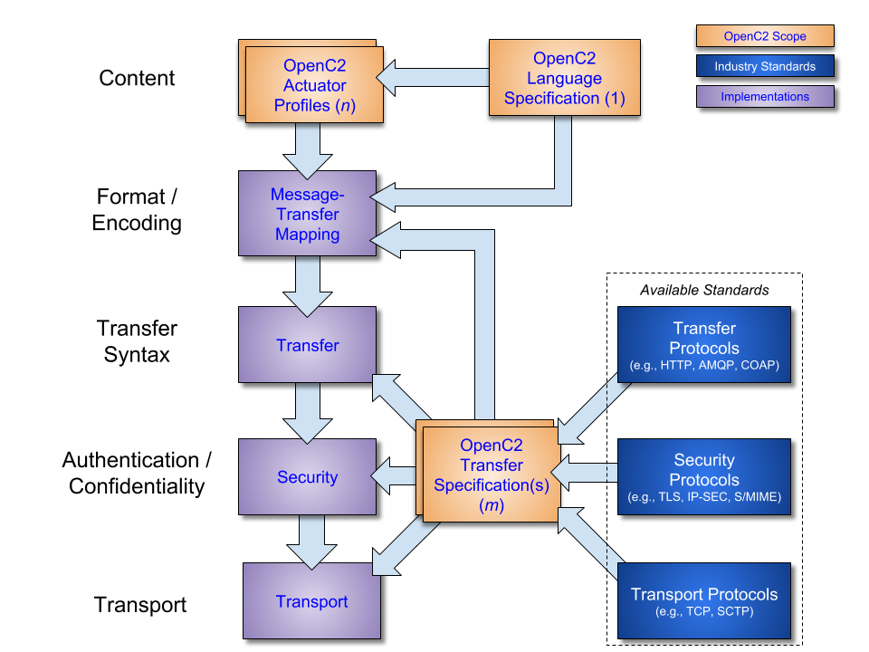

-------

# Open Command and Control (OpenC2) Language Specification Version 1.0 Errata 01
## Working Draft 15
## 31 October 2019

#### This version:
https://docs.oasis-open.org/openc2/oc2ls/v1.0/cs01/oc2ls-v1.0-cs01.md (Authoritative) \
https://docs.oasis-open.org/openc2/oc2ls/v1.0/cs01/oc2ls-v1.0-cs01.html \
https://docs.oasis-open.org/openc2/oc2ls/v1.0/cs01/oc2ls-v1.0-cs01.pdf

#### Previous version:
https://docs.oasis-open.org/openc2/oc2ls/v1.0/csprd02/oc2ls-v1.0-csprd02.md (Authoritative) \
https://docs.oasis-open.org/openc2/oc2ls/v1.0/csprd02/oc2ls-v1.0-csprd02.html \
https://docs.oasis-open.org/openc2/oc2ls/v1.0/csprd02/oc2ls-v1.0-csprd02.pdf

#### Latest version:
https://docs.oasis-open.org/openc2/oc2ls/v1.0/oc2ls-v1.0.md (Authoritative) \
https://docs.oasis-open.org/openc2/oc2ls/v1.0/oc2ls-v1.0.html \
https://docs.oasis-open.org/openc2/oc2ls/v1.0/oc2ls-v1.0.pdf

#### Technical Committee:
[OASIS Open Command and Control (OpenC2) TC](https://www.oasis-open.org/committees/openc2/)

#### Chairs:
Joe Brule (jmbrule@nsa.gov), [National Security Agency](https://www.nsa.gov/) \
Duncan Sparrell (duncan@sfractal.com), [sFractal Consulting LLC](http://www.sfractal.com/)

#### Editors:
Jason Romano (jdroman@nsa.gov), [National Security Agency](https://www.nsa.gov/) \
Duncan Sparrell (duncan@sfractal.com), [sFractal Consulting LLC](http://www.sfractal.com/)

#### Abstract:
Cyberattacks are increasingly sophisticated, less expensive to execute, dynamic and automated. The provision of cyber defense via statically configured products operating in isolation is untenable. Standardized interfaces, protocols and data models will facilitate the integration of the functional blocks within a system and between systems. Open Command and Control (OpenC2) is a concise and extensible language to enable machine-to-machine communications for purposes of command and control of cyber defense components, subsystems and/or systems in a manner that is agnostic of the underlying products, technologies, transport mechanisms or other aspects of the implementation. It should be understood that a language such as OpenC2 is necessary but insufficient to enable coordinated cyber responses that occur within cyber relevant time. Other aspects of coordinated cyber response such as sensing, analytics, and selecting appropriate courses of action are beyond the scope of OpenC2.

#### Status:
This document was last revised or approved by the OASIS Open Command and Control (OpenC2) TC on the above date. The level of approval is also listed above. Check the "Latest version" location noted above for possible later revisions of this document. Any other numbered Versions and other technical work produced by the Technical Committee (TC) are listed at https://www.oasis-open.org/committees/tc_home.php?wg_abbrev=openc2#technical.

TC members should send comments on this specification to the TC's email list. Others should send comments to the TC's public comment list, after subscribing to it by following the instructions at the "Send A Comment" button on the TC's web page at https://www.oasis-open.org/committees/openc2/.

This specification is provided under the [Non-Assertion](https://www.oasis-open.org/policies-guidelines/ipr#Non-Assertion-Mode) Mode of the OASIS IPR Policy, the mode chosen when the Technical Committee was established. For information on whether any patents have been disclosed that may be essential to implementing this specification, and any offers of patent licensing terms, please refer to the Intellectual Property Rights section of the TC's web page (https://www.oasis-open.org/committees/openc2/ipr.php).

Note that any machine-readable content ([Computer Language Definitions](https://www.oasis-open.org/policies-guidelines/tc-process#wpComponentsCompLang)) declared Normative for this Work Product is provided in separate plain text files. In the event of a discrepancy between any such plain text file and display content in the Work Product's prose narrative document(s), the content in the separate plain text file prevails.

#### Citation format:
When referencing this specification the following citation format should be used:

**[OpenC2-Lang-v1.0]**

_Open Command and Control (OpenC2) Language Specification Version 1.0_. Edited by Jason Romano and Duncan Sparrell. 23 May 2019. OASIS Committee Specification 01. https://docs.oasis-open.org/openc2/oc2ls/v1.0/cs01/oc2ls-v1.0-cs01.html. Latest version: https://docs.oasis-open.org/openc2/oc2ls/v1.0/oc2ls-v1.0.html.

-------

## Notices
Copyright © OASIS Open 2019. All Rights Reserved.

All capitalized terms in the following text have the meanings assigned to them in the OASIS Intellectual Property Rights Policy (the "OASIS IPR Policy"). The full [Policy](https://www.oasis-open.org/policies-guidelines/ipr) may be found at the OASIS website.

This document and translations of it may be copied and furnished to others, and derivative works that comment on or otherwise explain it or assist in its implementation may be prepared, copied, published, and distributed, in whole or in part, without restriction of any kind, provided that the above copyright notice and this section are included on all such copies and derivative works. However, this document itself may not be modified in any way, including by removing the copyright notice or references to OASIS, except as needed for the purpose of developing any document or deliverable produced by an OASIS Technical Committee (in which case the rules applicable to copyrights, as set forth in the OASIS IPR Policy, must be followed) or as required to translate it into languages other than English.

The limited permissions granted above are perpetual and will not be revoked by OASIS or its successors or assigns.

This document and the information contained herein is provided on an "AS IS" basis and OASIS DISCLAIMS ALL WARRANTIES, EXPRESS OR IMPLIED, INCLUDING BUT NOT LIMITED TO ANY WARRANTY THAT THE USE OF THE INFORMATION HEREIN WILL NOT INFRINGE ANY OWNERSHIP RIGHTS OR ANY IMPLIED WARRANTIES OF MERCHANTABILITY OR FITNESS FOR A PARTICULAR PURPOSE.

OASIS requests that any OASIS Party or any other party that believes it has patent claims that would necessarily be infringed by implementations of this OASIS Committee Specification or OASIS Standard, to notify OASIS TC Administrator and provide an indication of its willingness to grant patent licenses to such patent claims in a manner consistent with the IPR Mode of the OASIS Technical Committee that produced this specification.

OASIS invites any party to contact the OASIS TC Administrator if it is aware of a claim of ownership of any patent claims that would necessarily be infringed by implementations of this specification by a patent holder that is not willing to provide a license to such patent claims in a manner consistent with the IPR Mode of the OASIS Technical Committee that produced this specification. OASIS may include such claims on its website, but disclaims any obligation to do so.

OASIS takes no position regarding the validity or scope of any intellectual property or other rights that might be claimed to pertain to the implementation or use of the technology described in this document or the extent to which any license under such rights might or might not be available; neither does it represent that it has made any effort to identify any such rights. Information on OASIS' procedures with respect to rights in any document or deliverable produced by an OASIS Technical Committee can be found on the OASIS website. Copies of claims of rights made available for publication and any assurances of licenses to be made available, or the result of an attempt made to obtain a general license or permission for the use of such proprietary rights by implementers or users of this OASIS Committee Specification or OASIS Standard, can be obtained from the OASIS TC Administrator. OASIS makes no representation that any information or list of intellectual property rights will at any time be complete, or that any claims in such list are, in fact, Essential Claims.

The name "OASIS" is a trademark of [OASIS](https://www.oasis-open.org/), the owner and developer of this specification, and should be used only to refer to the organization and its official outputs. OASIS welcomes reference to, and implementation and use of, specifications, while reserving the right to enforce its marks against misleading uses. Please see https://www.oasis-open.org/policies-guidelines/trademark for above guidance.

-------

# Table of Contents
-   [1 Introduction](#1-introduction)
    -   [1.1 IPR Policy](#11-ipr-policy)
    -   [1.2 Terminology](#12-terminology)
    -   [1.3 Normative References](#13-normative-references)
    -   [1.4 Non-Normative References](#14-non-normative-references)
    -   [1.5 Document Conventions](#15-document-conventions)
        -   [1.5.1 Naming Conventions](#151-naming-conventions)
        -   [1.5.2 Font Colors and Style](#152-font-colors-and-style)
    -   [1.6 Overview](#16-overview)
    -   [1.7 Goal](#17-goal)
    -   [1.8 Purpose and Scope](#18-purpose-and-scope)
-   [2 OpenC2 Language Description](#2-openc2-language-description)
    -   [2.1 OpenC2 Command](#21-openc2-command)
    -   [2.2 OpenC2 Response](#22-openc2-response)
-   [3 OpenC2 Language Definition](#3-openc2-language-definition)
    -   [3.1 Base Components and
        Structures](#31-base-components-and-structures)
        -   [3.1.1 Data Types](#311-data-types)
        -   [3.1.2 Semantic Value Constraints](#312-semantic-value-constraints)
        -   [3.1.3 Multiplicity](#313-multiplicity)
        -   [3.1.4 Extensions](#314-extensions)
        -   [3.1.5 Serialization](#315-serialization)
    -   [3.2 Message](#32-message)
    -   [3.3 Content](#33-content)
        -   [3.3.1 OpenC2 Command](#331-openc2-command)
            -   [3.3.1.1 Action](#3311-action)
            -   [3.3.1.2 Target](#3312-target)
            -   [3.3.1.3 Actuator](#3313-actuator)
            -   [3.3.1.4 Command Arguments](#3314-command-arguments)
        -   [3.3.2 OpenC2 Response](#332-openc2-response)
            -   [3.3.2.1 Response Status Code](#3321-response-status-code)
            -   [3.3.2.2 Response Results](#3322-response-results)
    -   [3.4 Type Definitions](#34-type-definitions)
        -   [3.4.1 Target Types](#341-target-types)
            -   [3.4.1.1 Artifact](#3411-artifact)
            -   [3.4.1.2 Device](#3412-device)
            -   [3.4.1.3 Domain Name](#3413-domain-name)
            -   [3.4.1.4 Email Address](#3414-email-address)
            -   [3.4.1.5 Features](#3415-features)
            -   [3.4.1.6 File](#3416-file)
            -   [3.4.1.7 Internationalized Domain Name](#3417-internationalized-domain-name)
            -   [3.4.1.8 Internationalized Email Address](#3418-internationalized-email-address)
            -   [3.4.1.9 IPv4 Address Range](#3419-ipv4-address-range)
            -   [3.4.1.10 IPv4 Connection](#34110-ipv4-connection)
            -   [3.4.1.11 IPv6 Address Range](#34111-ipv6-address-range)
            -   [3.4.1.12 IPv6 Connection](#34112-ipv6-connection)
            -   [3.4.1.13 IRI](#34113-iri)
            -   [3.4.1.14 MAC Address](#34114-mac-address)
            -   [3.4.1.15 Process](#34115-process)
            -   [3.4.1.16 Properties](#34116-properties)
            -   [3.4.1.17 URI](#34117-uri)
        -   [3.4.2 Data Types](#342-data-types)
            -   [3.4.2.1 Action-Targets](#3421-action-targets)
            -   [3.4.2.2 Date-Time](#3422-date-time)
            -   [3.4.2.3 Duration](#3423-duration)
            -   [3.4.2.4 Feature](#3424-feature)
            -   [3.4.2.5 Hashes](#3425-hashes)
            -   [3.4.2.6 Hostname](#3426-hostname)
            -   [3.4.2.7 Internationalized Hostname](#3427-internationalized-hostname)
            -   [3.4.2.8 IPv4 Address](#3428-ipv4-address)
            -   [3.4.2.9 IPv6 Address](#3429-ipv6-address)
            -   [3.4.2.10 L4 Protocol](#34210-l4-protocol)
            -   [3.4.2.11 Message-Type](#34211-message-type)
            -   [3.4.2.12 Namespace Identifier](#34212-namespace-identifier)
            -   [3.4.2.13 Payload](#34213-payload)
            -   [3.4.2.14 Port](#34214-port)
            -   [3.4.2.15 Response-Type](#34215-response-type)
            -   [3.4.2.16 Version](#34216-version)
-   [4 Mandatory Commands/Responses](#4-mandatory-commandsresponses)
    -   [4.1 Implementation of 'query features' Command](#41-implementation-of-query-features-command)
    -   [4.2 Examples of 'query features' Commands and Responses](#42-examples-of-query-features-commands-and-responses)
-   [5 Conformance](#5-conformance)
    -   [5.1 Conformance Clause 1: Command](#51-conformance-clause-1-command)
    -   [5.2 Conformance Clause 2: Response](#52-conformance-clause-2-response)
    -   [5.3 Conformance Clause 3: Producer](#53-conformance-clause-3-producer)
    -   [5.4 Conformance Clause 4: Consumer](#54-conformance-clause-4-consumer)
-   [Annex A. Examples](#annex-a-examples)
    -   [A.1 Example 1](#a1-example-1)
    -   [A.2 Example 2](#a2-example-2)
    -   [A.3 Example 3](#a3-example-3)
-   [Annex B. Acronyms](#annex-b-acronyms)
-   [Annex C. Design Elements](#annex-c-design-elements)
-   [Annex D. Revision History](#annex-d-revision-history)
-   [Annex E. Acknowledgments](#annex-e-acknowledgments)

-------

# 1 Introduction

_The content in this section is non-normative, except where it is marked normative._

OpenC2 is a suite of specifications that enables command and control of cyber defense systems and components. OpenC2 typically uses a request-response paradigm where a _Command_ is encoded by a _Producer_ (managing application) and transferred to a _Consumer_ (managed device or virtualized function) using a secure transfer protocol, and the Consumer can respond with status and any requested information.

OpenC2 allows the application producing the commands to discover the set of capabilities supported by the managed devices. These capabilities permit the managing application to adjust its behavior to take advantage of the features exposed by the managed device. The capability definitions can be easily extended in a noncentralized manner, allowing standard and non-standard capabilities to be defined with semantic and syntactic rigor.

## 1.1 IPR Policy
This specification is provided under the [Non-Assertion](https://www.oasis-open.org/policies-guidelines/ipr#Non-Assertion-Mode) Mode of the [OASIS IPR Policy](https://www.oasis-open.org/policies-guidelines/ipr), the mode chosen when the Technical Committee was established. For information on whether any patents have been disclosed that may be essential to implementing this specification, and any offers of patent licensing terms, please refer to the Intellectual Property Rights section of the TC's web page ([https://www.oasis-open.org/committees/openc2/ipr.php](https://www.oasis-open.org/committees/openc2/ipr.php)).

## 1.2 Terminology

_This section is normative._

* **Action**: The task or activity to be performed (e.g., 'deny').
* **Actuator**: The function performed by the Consumer that executes the Command (e.g., 'Stateless Packet Filtering').
* **Argument**: A property of a Command that provides additional information on how to perform the Command, such as date/time, periodicity, duration, etc.
* **Command**: A Message defined by an Action-Target pair that is sent from a Producer and received by a Consumer.
* **Consumer**: A managed device / application that receives Commands. Note that a single device / application can have both Consumer and Producer capabilities.
* **Message**: A content- and transport-independent set of elements conveyed between Consumers and Producers.
* **Producer**: A manager application that sends Commands.
* **Response**: A Message from a Consumer to a Producer acknowledging a Command or returning the requested resources or status to a previously received Command.
* **Specifier**: A property or field that identifies a Target or Actuator to some level of precision.
* **Target**: The object of the Action, i.e., the Action is performed on the Target (e.g., IP Address).

The key words "MUST", "MUST NOT", "REQUIRED", "SHALL", "SHALL NOT", "SHOULD", "SHOULD NOT", "RECOMMENDED", "NOT RECOMMENDED", "MAY", and "OPTIONAL" in this document are to be interpreted as described in [[RFC2119](#rfc2119)] and [[RFC8174](#rfc8174)] when, and only when, they appear in all capitals, as shown here.

## 1.3 Normative References

###### [OpenC2-HTTPS-v1.0]
_Specification for Transfer of OpenC2 Messages via HTTPS Version 1.0_. Edited by David Lemire. Latest version: http://docs.oasis-open.org/openc2/open-impl-https/v1.0/open-impl-https-v1.0.html
###### [OpenC2-SLPF-v1.0]
_Open Command and Control (OpenC2) Profile for Stateless Packet Filtering Version 1.0_. Edited by Joe Brule, Duncan Sparrell, and Alex Everett. Latest version: http://docs.oasis-open.org/openc2/oc2slpf/v1.0/oc2slpf-v1.0.html
###### [RFC0768]
Postel, J., "User Datagram Protocol", STD 6, RFC 768, DOI 10.17487/RFC0768, August 1980, <https://www.rfc-editor.org/info/rfc768>.
###### [RFC0791]
Postel, J., "Internet Protocol", STD 5, RFC 791, DOI 10.17487/RFC0791, September 1981, <https://www.rfc-editor.org/info/rfc791>.
###### [RFC0792]
Postel, J., "Internet Control Message Protocol", STD 5, RFC 792, DOI 10.17487/RFC0792, September 1981, <https://www.rfc-editor.org/info/rfc792>.
###### [RFC0793]
Postel, J., "Transmission Control Protocol", STD 7, RFC 793, DOI 10.17487/RFC0793, September 1981, <https://www.rfc-editor.org/info/rfc793>.
###### [RFC1034]
Mockapetris, P., "Domain names - concepts and facilities", STD 13, RFC 1034, DOI 10.17487/RFC1034, November 1987, <https://www.rfc-editor.org/info/rfc1034>.
###### [RFC1123]
Braden, R., Ed., "Requirements for Internet Hosts - Application and Support", STD 3, RFC 1123, DOI 10.17487/RFC1123, October 1989, <https://www.rfc-editor.org/info/rfc1123>.
###### [RFC1321]
Rivest, R., "The MD5 Message-Digest Algorithm", RFC 1321, DOI 10.17487/RFC1321, April 1992, <https://www.rfc-editor.org/info/rfc1321>.
###### [RFC2119]
Bradner, S., "Key words for use in RFCs to Indicate Requirement Levels", BCP 14, RFC 2119, DOI 10.17487/RFC2119, March 1997, <https://www.rfc-editor.org/info/rfc2119>.
###### [RFC2673]
Crawford, M., *"Binary Labels in the Domain Name System"*, RFC 2673, August 1999, https://tools.ietf.org/html/rfc2673
###### [RFC3986]
Berners-Lee, T., Fielding, R., and L. Masinter, "Uniform Resource Identifier (URI): Generic Syntax", STD 66, RFC 3986, DOI 10.17487/RFC3986, January 2005, <https://www.rfc-editor.org/info/rfc3986>.
###### [RFC3987]
Duerst, M. and M. Suignard, "Internationalized Resource Identifiers (IRIs)", RFC 3987, DOI 10.17487/RFC3987, January 2005, <https://www.rfc-editor.org/info/rfc3987>.
###### [RFC4122]
Leach, P., Mealling, M., and R. Salz, "A Universally Unique IDentifier (UUID) URN Namespace", RFC 4122, DOI 10.17487/RFC4122, July 2005, <https://www.rfc-editor.org/info/rfc4122>.
###### [RFC4291]
Hinden, R. and S. Deering, "IP Version 6 Addressing Architecture", RFC 4291, DOI 10.17487/RFC4291, February 2006, <https://www.rfc-editor.org/info/rfc4291>.
###### [RFC4632]
Fuller, V. and T. Li, "Classless Inter-domain Routing (CIDR): The Internet Address Assignment and Aggregation Plan", BCP 122, RFC 4632, DOI 10.17487/RFC4632, August 2006, <https://www.rfc-editor.org/info/rfc4632>.
###### [RFC4648]
Josefsson, S., "The Base16, Base32, and Base64 Data Encodings", RFC 4648, DOI 10.17487/RFC4648, October 2006, <https://www.rfc-editor.org/info/rfc4648>.
###### [RFC4960]
Stewart, R., Ed., "Stream Control Transmission Protocol", RFC 4960, DOI 10.17487/RFC4960, September 2007, <https://www.rfc-editor.org/info/rfc4960>.
###### [RFC5237]
Arkko, J. and S. Bradner, "IANA Allocation Guidelines for the Protocol Field", BCP 37, RFC 5237, DOI 10.17487/RFC5237, February 2008, <https://www.rfc-editor.org/info/rfc5237>.
###### [RFC5322]
Resnick, P., Ed., "Internet Message Format", RFC 5322, DOI 10.17487/RFC5322, October 2008, <https://www.rfc-editor.org/info/rfc5322>.
###### [RFC5890]
Klensin, J., "Internationalized Domain Names for Applications (IDNA): Definitions and Document Framework", RFC 5890, DOI 10.17487/RFC5890, August 2010, <https://www.rfc-editor.org/info/rfc5890>.
###### [RFC5952]
Kawamura, S. and M. Kawashima, "A Recommendation for IPv6 Address Text Representation", RFC 5952, DOI 10.17487/RFC5952, August 2010, <https://www.rfc-editor.org/info/rfc5952>.
###### [RFC6234]
Eastlake 3rd, D. and T. Hansen, "US Secure Hash Algorithms (SHA and SHA-based HMAC and HKDF)", RFC 6234, DOI 10.17487/RFC6234, May 2011, <https://www.rfc-editor.org/info/rfc6234>.
###### [RFC6335]
Cotton, M., Eggert, L., Touch, J., Westerlund, M., and S. Cheshire, "Internet Assigned Numbers Authority (IANA) Procedures for the Management of the Service Name and Transport Protocol Port Number Registry", BCP 165, RFC 6335, DOI 10.17487/RFC6335, August 2011, <https://www.rfc-editor.org/info/rfc6335>.
###### [RFC6531]
Yao, J. and W. Mao, "SMTP Extension for Internationalized Email", RFC 6531, DOI 10.17487/RFC6531, February 2012, <https://www.rfc-editor.org/info/rfc6531>.
###### [RFC6838]
Freed, N., Klensin, J., and T. Hansen, "Media Type Specifications and Registration Procedures", BCP 13, RFC 6838, DOI 10.17487/RFC6838, January 2013, <https://www.rfc-editor.org/info/rfc6838>.
###### [RFC7493]
Bray, T., Ed., "The I-JSON Message Format", RFC 7493, DOI 10.17487/RFC7493, March 2015, <https://www.rfc-editor.org/info/rfc7493>.
###### [RFC8174]
Leiba, B., "Ambiguity of Uppercase vs Lowercase in RFC 2119 Key Words", BCP 14, RFC 8174, DOI 10.17487/RFC8174, May 2017, <https://www.rfc-editor.org/info/rfc8174>.
###### [RFC8200]
Deering, S. and R. Hinden, "Internet Protocol, Version 6 (IPv6) Specification", STD 86, RFC 8200, DOI 10.17487/RFC8200, July 2017, <https://www.rfc-editor.org/info/rfc8200>.
###### [RFC8259]
Bray, T., Ed., "The JavaScript Object Notation (JSON) Data Interchange Format", STD 90, RFC 8259, DOI 10.17487/RFC8259, December 2017, <https://www.rfc-editor.org/info/rfc8259>.
###### [EUI]
"IEEE Registration Authority Guidelines for use of EUI, OUI, and CID", IEEE, August 2017, https://standards.ieee.org/content/dam/ieee-standards/standards/web/documents/tutorials/eui.pdf

## 1.4 Non-Normative References
###### [IACD]
M. J. Herring, K. D. Willett, "Active Cyber Defense: A Vision for Real-Time Cyber Defense," Journal of Information Warfare, vol. 13, Issue 2, p. 80, April 2014.<https://www.semanticscholar.org/paper/Active-Cyber-Defense-%3A-A-Vision-for-Real-Time-Cyber-Herring-Willett/7c128468ae42584f282578b86439dbe9e8c904a8>.<br><br>Willett, Keith D., "Integrated Adaptive Cyberspace Defense: Secure Orchestration", International Command and Control Research and Technology Symposium, June 2015 <https://www.semanticscholar.org/paper/Integrated-Adaptive-Cyberspace-Defense-%3A-Secure-by-Willett/a22881b8a046e7eab11acf647d530c2a3b03b762>.
###### [UML]
"UML Multiplicity and Collections", https://www.uml-diagrams.org/multiplicity.html

## 1.5 Document Conventions
### 1.5.1 Naming Conventions
* [[RFC2119]](#rfc2119)/[[RFC8174]](#rfc8174) key words (see [Section 1.2](#12-terminology)) are in all uppercase.
* All property names and literals are in lowercase, except when referencing canonical names defined in another standard (e.g., literal values from an IANA registry).
* All type names begin with an uppercase character.
* Property names and type names are between 1 and 32 characters long.
* Words in property names are separated with an underscore (_), while words in type names are separated with a hyphen (-).
* "Underscore" refers to Unicode "low line", U+005F; "hyphen" refers to Unicode "hyphen-minus", U+002D.

### 1.5.2 Font Colors and Style
The following color, font and font style conventions are used in this document:

* A fixed width font is used for all type names, property names, and literals.
* Property names are in bold style – **'created_at'**.
* All examples in this document are expressed in JSON. They are in fixed width font, with straight quotes, black text and a light shaded background, and 4-space indentation. JSON examples in this document are representations of JSON Objects. They should not be interpreted as string literals. The ordering of object keys is insignificant. Whitespace before or after JSON structural characters in the examples are insignificant [[RFC8259]](#rfc8259).
* Parts of the example may be omitted for conciseness and clarity. These omitted parts are denoted with ellipses (...).

Example:

```json
{
    "action": "deny",
    "target": {
        "file": {
            "hashes": {
                "sha256": "22fe72a34f006ea67d26bb7004e2b6941b5c3953d43ae7ec24d41b1a928a6973"
            }
        }
    }
}
```

## 1.6 Overview
In general, there are two types of participants involved in the exchange of OpenC2 Messages, as depicted in Figure 1-1:
1. **Producers**: A Producer is an entity that creates Commands to provide instruction to one or more systems to act in accordance with the content of the Command. A Producer may receive and process Responses in conjunction with a Command.
2. **Consumers**: A Consumer is an entity that receives and may act upon a Command. A Consumer may create Responses that provide any information captured or necessary to send back to the Producer.


**Figure 1-1. OpenC2 Message Exchange**

OpenC2 is a suite of specifications for Producers and Consumers to command and execute cyber defense functions. These specifications include the OpenC2 Language Specification, Actuator Profiles, and Transfer Specifications. The OpenC2 Language Specification and Actuator Profile specifications focus on the language content and meaning at the Producer and Consumer of the Command and Response while the transfer specifications focus on the protocols for their exchange.
* The **OpenC2 Language Specification** (this document) provides the semantics for the essential elements of the language, the structure for Commands and Responses, and the schema that defines the proper syntax for the language elements that represents the Command or Response.
* **OpenC2 Actuator Profiles** specify the subset of the OpenC2 language relevant in the context of specific Actuator functions. Cyber defense components, devices, systems and/or instances may (in fact are likely to) implement multiple Actuator profiles. Actuator profiles extend the language by defining Specifiers that identify the Actuator to the required level of precision. Actuator Profiles may define Command Arguments and Targets that are relevant and/or unique to those Actuator functions.
* **OpenC2 Transfer Specifications** utilize existing protocols and standards to implement OpenC2 in specific environments. These standards are used for communications and security functions beyond the scope of the language, such as message transfer encoding, authentication, and end-to-end transport of OpenC2 Messages.

The OpenC2 Language Specification defines a language used to compose Messages for command and control of cyber defense systems and components. A Message consists of a header and a payload (_defined_ as a Message body in the OpenC2 Language Specification Version 1.0 and _specified_ in one or more Actuator profiles).

The language defines two payload structures:

1. **Command**: An instruction from one system known as the Producer, to one or more systems, the Consumer(s), to act on the content of the Command.
2. **Response**: Any information sent back to the Producer as a result of the Command.

OpenC2 implementations integrate the related OpenC2 specifications described above with related industry specifications, protocols, and standards. Figure 1-2 depicts the relationships among OpenC2 specifications, and their relationships to other industry standards and environment-specific implementations of OpenC2. Note that the layering of implementation aspects in the diagram is notional, and not intended to preclude any particular approach to implementing the needed functionality (for example, the use of an application-layer message signature function to provide message source authentication and integrity).



**Figure 1-2. OpenC2 Documentation and Layering Model**

OpenC2 is conceptually partitioned into four layers as shown in Table 1-1.

**Table 1-1. OpenC2 Protocol Layers**

| Layer | Examples |
| :--- | :--- |
| Function-Specific Content | Actuator Profiles<br>([[OpenC2-SLPF-v1.0]](#openc2-slpf-v10), ...) |
| Common Content | Language Specification<br>(this document) |
| Message | Transfer Specifications<br>([[OpenC2-HTTPS-v1.0]](#openc2-https-v10), OpenC2-over-CoAP, ...) |
| Secure Transport | HTTPS, CoAP, MQTT, OpenDXL, ... |

* The **Secure Transport** layer provides a communication path between the Producer and the Consumer. OpenC2 can be layered over any standard transport protocol.
* The **Message** layer provides a transfer- and content-independent mechanism for conveying Messages. A transfer specification maps transfer-specific protocol elements to a transfer-independent set of message elements consisting of content and associated metadata.
* The **Common Content** layer defines the structure of Commands and Responses and a set of common language elements used to construct them.
* The **Function-specific Content** layer defines the language elements used to support a particular cyber defense function. An Actuator profile defines the implementation conformance requirements for that function. Producers and Consumers will support one or more profiles.

The components of a Command are an Action (what is to be done), a Target (what is being acted upon), an optional Actuator (what is performing the command), and Command Arguments, which influence how the Command is to be performed. An Action coupled with a Target is sufficient to describe a complete Command. Though optional, the inclusion of an Actuator and/or Command Arguments provides additional precision to a Command.

The components of a Response are a numerical status code, an optional status text string, and optional results. The format of the results, if included, depend on the type of Response being transferred.

## 1.7 Goal
The goal of the OpenC2 Language Specification is to provide a language for interoperating between functional elements of cyber defense systems. This language used in conjunction with OpenC2 Actuator Profiles and OpenC2 Transfer Specifications allows for vendor-agnostic cybertime response to attacks.

The Integrated Adaptive Cyber Defense (IACD) framework defines a collection of activities, based on the traditional OODA (Observe–Orient–Decide–Act) Loop [[IACD]](#iacd):

* Sensing:  gathering of data regarding system activities
* Sense Making:  evaluating data using analytics to understand what's happening
* Decision Making:  determining a course-of-action to respond to system events
* Acting:  Executing the course-of-action

The goal of OpenC2 is to enable coordinated defense in cyber-relevant time between decoupled blocks that perform cyber defense functions. OpenC2 focuses on the Acting portion of the IACD framework; the assumption that underlies the design of OpenC2 is that the sensing/analytics have been provisioned and the decision to act has been made. This goal and these assumptions guide the design of OpenC2:

* **Technology Agnostic:**  The OpenC2 language defines a set of abstract atomic cyber defense actions in a platform and implementation agnostic manner
* **Concise:**  A Command is intended to convey only the essential information required to describe the action required and can be represented in a very compact form for communications-constrained environments
* **Abstract:**  Commands and Responses are defined abstractly and can be encoded and transferred via multiple schemes as dictated by the needs of different implementation environments
* **Extensible:**  While OpenC2 defines a core set of Actions and Targets for cyber defense, the language is expected to evolve with cyber defense technologies, and permits extensions to accommodate new cyber defense technologies.

## 1.8 Purpose and Scope
The OpenC2 Language Specification defines the set of components to assemble a complete command and control Message and provides a framework so that the language can be extended. To achieve this purpose, the scope of this specification includes:

1. the set of Actions and options that may be used in Commands
2. the set of Targets and Target Specifiers
3. a syntax that defines the structure of Commands and Responses
4. a JSON serialization of Commands and Responses
5. the procedures for extending the language

The OpenC2 language assumes that the event has been detected, a decision to act has been made, the act is warranted, and the initiator and recipient of the Commands are authenticated and authorized. The OpenC2 language was designed to be agnostic of the other aspects of cyber defense implementations that realize these assumptions. The following items are beyond the scope of this specification:

1. Language elements applicable to some Actuators, which may be defined in individual Actuator profiles.
2. Alternate serializations of Commands and Responses.
3. The enumeration of the protocols required for transport, information assurance, sensing, analytics and other external dependencies.

-------

# 2 OpenC2 Language Description

_The content in this section is non-normative._

The OpenC2 language has two distinct message types: Command and Response. The Command is sent from a Producer to a Consumer and describes an Action to be performed by an Actuator on a Target. The Response is sent from a Consumer, usually back to the Producer, and is a means to provide information (such as acknowledgment, status, etc.) as a result of a Command.

## 2.1 OpenC2 Command
The Command describes an Action to be performed on a Target and may include information identifying the Actuator or Actuators that are to execute the Command.

A Command has four main components, two required and two optional. The required components are the Action and the Target. The optional components are Command Arguments and the Actuator. A Command can also contain an optional Command identifier, if necessary. [Section 3.3.1](#331-openc2-command) defines the syntax of an OpenC2 Command.

The following list summarizes the main four components of a Command.

* **Action** (required): The task or activity to be performed.
* **Target** (required): The object of the action. The Action is performed on the Target. Properties of the Target, called Target Specifiers, further identify the Target to some level of precision, such as a specific Target, a list of Targets, or a class of Targets.
* **Arguments** (optional): Provide additional information on how the command is to be performed, such as date/time, periodicity, duration, etc.
* **Actuator** (optional): The Actuator executes the Command. The Actuator will be defined within the context of an Actuator Profile. Properties of the Actuator, called Actuator Specifiers, further identify the Actuator to some level of precision, such as a specific Actuator, a list of Actuators, or a group of Actuators.

The Action and Target components are required and are populated by one of the Actions in [Section 3.3.1.1](#3311-action) and the Targets in [Section 3.3.1.2](#3312-target). A particular Target may be further refined by the Target type definitions in [Section 3.4.1](#341-target-types). Procedures to extend the Targets are described in [Section 3.1.4](#314-extensions).

Command Arguments, if present, influence the Command by providing information such as timing, periodicity, duration, or other details on what is to be executed. They can also be used to convey the need for acknowledgment or additional status information about the execution of a Command. The valid Arguments defined in this specification are in [Section 3.3.1.4](#3314-command-arguments). Procedures to extend Arguments are described in [Section 3.1.4](#314-extensions).

An Actuator is an implementation of a cyber defense function that executes the Command. An Actuator Profile is a specification that identifies the subset of Actions, Targets and other aspects of this language specification that are required or optional in the context of a particular Actuator. An Actuator Profile may extend the language by defining additional Targets, Arguments, and Actuator Specifiers that are meaningful and possibly unique to the Actuator.

The Actuator may be omitted from a Command and typically will not be included in implementations where the identities of the endpoints are unambiguous or when a high-level effects-based Command is desired and the tactical decisions on how the effect is achieved is left to the recipient.

## 2.2 OpenC2 Response
The Response is a Message sent from the recipient of a Command. Response messages provide acknowledgment, status, results from a query, or other information. At a minimum, a Response will contain a status code to indicate the result of performing the Command. Additional status text and response fields optionally provide more detailed information that is specific to or requested by the Command. [Section 3.3.2](#332-openc2-response) defines the syntax of an OpenC2 Response.

-------

# 3 OpenC2 Language Definition

_The content in this section is normative._

## 3.1 Base Components and Structures
### 3.1.1 Data Types
OpenC2 data types are defined using an abstract notation that is independent of both their representation within applications ("**API**" values) and their format for transmission between applications ("**serialized**" values). The data types used in OpenC2 Messages are:

| Type | Description |
| :--- | :--- |
| **Primitive Types** |   |
| Any | Anything, used to designate fields with an unspecified value. |
| Binary | A sequence of octets. Length is the number of octets. |
| Boolean | An element with one of two values: `true` and `false`. |
| Integer | A whole number. |
| Number | A real number. |
| Null | Nothing, used to designate fields with no value. |
| String | A sequence of characters, each of which has a Unicode codepoint. Length is the number of characters. |
| **Structures** |   |
| Array | An ordered list of unnamed fields with positionally-defined semantics. Each field has a position, label, and type. |
| ArrayOf(*vtype*) | An ordered list of fields with the same semantics. Each field has a position and type *vtype*. |
| Choice | One field selected from a set of named fields. The API value has a name and a type. |
| Choice.ID | One field selected from a set of fields. The API value has an id and a type. |
| Enumerated | A set of named integral constants. The API value is a name. |
| Enumerated.ID | A set of unnamed integral constants. The API value is an id. |
| Map | An unordered map from a set of specified keys to values with semantics bound to each key. Each field has an id, name and type. |
| Map.ID | An unordered set of fields. The API value of each field has an id, label, and type. |
| MapOf(*ktype*, *vtype*) | An unordered set of keys to values with the same semantics. Each key has key type *ktype* and is mapped to value type *vtype*. |
| Record | An ordered map from a list of keys with positions to values with positionally-defined semantics. Each key has a position and name, and is mapped to a type. Represents a row in a spreadsheet or database table. |

* **API** values do not affect interoperabilty, and although they must exhibit the characteristics specified above, their representation within applications is unspecified. A Python application might represent the Map type as a dict variable, a javascript application might represent it as an object literal or an ES6 Map type, and a C# application might represent it as a Dictionary or a Hashtable.

* **Serialized** values are critical to interoperability, and this document defines a set of **serialization rules** that unambiguously define how each of the above types are serialized using a human-friendly JSON format. Other serialization rules, such as for XML, machine-optimized JSON, and CBOR formats, exist but are out of scope for this document. Both the format-specific serialization rules in [Section 3.1.5](#315-serialization) and the format-agnostic type definitions in [Section 3.4](#34-type-definitions) are Normative.

Types defined with an ".ID" suffix (Choice.ID, Enumerated.ID, Map.ID) are equivalent to the non-suffixed types except:

1. Field definitions and API values are identified only by ID. The non-normative description may include a suggested name.
2. Serialized values of Enumerated types and keys of Choice/Map types are IDs regardless of serialization format.

OpenC2 type definitions are presented in table format. All table columns except Description are Normative. The Description column is always Non-normative.

For types without individual field definitions (Primitive types and ArrayOf), the type definition includes the name of the type being defined and the definition of that type. This table defines a type called *Email-Addr* that is a *String* that has a semantic value constraint of *email*:

| Type Name | Type Definition | Description |
| :--- | :--- | :--- |
| **Email-Addr** | String (email) | Email address |

For Structure types, the definition includes the name of the type being defined, the built-in type on which it is based, and options applicable to the type as a whole. This is followed by a table defining each of the fields in the structure. This table defines a type called *Args* that is a *Map* containing at least one field. Each of the fields has an integer Tag/ID, a Name, and a Type. Each field in this definition is optional (Multiplicity = 0..1), but per the type definition at least one must be present.

**_Type: Args (Map{1..*})_**

| ID | Name | Type | # | Description |
| :--- | :--- | :--- | :--- | :--- |
| 1 | **start_time** | Date-Time | 0..1 | The specific date/time to initiate the action |
| 2 | **stop_time** | Date-Time | 0..1 | The specific date/time to terminate the action |
| 3 | **duration** | Duration | 0..1 | The length of time for an action to be in effect |

The field columns present in a structure definition depends on the base type:

| Base Type | Field Definition Columns |
| :--- | :--- |
| Enumerated.ID | ID, Description |
| Enumerated | ID, Name, Description |
| Array, Choice.ID, Map.ID | ID, Type, Multiplicity (#), Description |
| Choice, Map, Record | ID, Name, Type, Multiplicity (#), Description |

The ID column of Array and Record types contains the ordinal position of the field, numbered sequentially starting at 1. The ID column of Choice, Enumerated, and Map types contains tags with arbitrary integer values. IDs and Names are unique within each type definition.

### 3.1.2 Semantic Value Constraints
Structural validation alone may be insufficient to validate that an instance meets all the requirements of an application. Semantic validation keywords specify value constraints for which an authoritative definition exists.

| Keyword | Applies to Type | Constraint |
| :--- | :--- | :--- |
| **email** | String | Value must be an email address as defined in [[RFC5322]](#rfc5322), Section 3.4.1 |
| **eui** | Binary | Value must be an EUI-48 or EUI-64 as defined in [[EUI]](#eui) |
| **hostname** | String | Value must be a hostname as defined in [[RFC1034]](#rfc1034), Section 3.1 |
| **idn-email** | String | Value must be an internationalized email address as defined in [[RFC6531]](#rfc6531) |
| **idn-hostname** | String | Value must be an internationalized hostname as defined in [[RFC5890]](#rfc5890), Section 2.3.2.3 |
| **iri** | String | Value must be an Internationalized Resource Identifier (IRI) as defined in [[RFC3987]](#rfc3987) |
| **uri** | String | Value must be a Uniform Resource Identifier (URI) as defined in [[RFC3986]](#rfc3986) |

### 3.1.3 Multiplicity
Property tables for types based on Array, Choice, Map and Record include a multiplicity column (#) that specifies the minimum and maximum cardinality (number of elements) of a field. As used in the Unified Modeling Language ([[UML]](#uml)), typical examples of multiplicity are:

| Multiplicity | Description | Keywords |
| :--- | :--- | :--- |
| 1 | Exactly one instance | Required |
| 0..1 | No instances or one instance | Optional |
| 1..* | At least one instance | Required, Repeatable |
| 0..* | Zero or more instances | Optional, Repeatable |
| m..n | At least m but no more than n instances | Required, Repeatable |

When a repeatable field type is converted to a separate ArrayOf() Type, multiplicity is converted to the array size, enclosed in curly brackets, e.g.,:

| Type Name | Type Definition | Description |
| :--- | :--- | :--- |
| **Features** | ArrayOf(Feature){0..10} | An array of zero to ten names used to query an actuator for its supported capabilities. |

A multiplicity of 0..1 denotes a single optional value of the specified type. A multiplicity of 0..n denotes a field that is either omitted or is an array containing one or more values of the specified type.

An array containing zero or more values of a specified type cannot be created implicitly using multiplicity, it must be defined explicitly as a named ArrayOf type. The named type can then be used as the type of a required field (multiplicity 1). Results are unspecified if an optional field (multiplicity 0..1) is a named ArrayOf type with a minimum length of zero.

### 3.1.4 Extensions
One of the main design goals of OpenC2 was extensibility. Actuator profiles define the language extensions that are meaningful and possibly unique to the Actuator.

Each Actuator profile has a unique name used to identify the profile document and a short reference called a namespace identifier (NSID). The NSID is used to separate extensions from the core language defined in this specification.

All extensions MUST be identified with a short namespace reference, called a namespace identifier (NSID).

For example, the OASIS standard Stateless Packet Filtering actuator profile has:
* **Unique Name**: http://docs.oasis-open.org/openc2/oc2slpf/v1.0/oc2slpf-v1.0.md
* **NSID**: slpf

The namespace identifier for non-standard extensions MUST be prefixed with "x-".

For example, the fictional, non-standard Superwidget actuator profile has:
* **Unique Name**: http://www.acme.com/openc2/superwidget-v1.0.html
* **NSID**: x-acme

The list of Actions in [Section 3.3.1.1](#3311-action) SHALL NOT be extended.

Targets, defined in [Section 3.3.1.2](#3312-target), MAY be extended. Extended Target names MUST be prefixed with a namespace identifier followed by a colon (":").

**Example:**
In this example Command, the extended Target, `rule_number`, is defined within the Stateless Packet Filtering Profile with the namespace identifier, `slpf`.

```json
{
    "action": "delete",
    "target": {
        "slpf:rule_number": 1234
    }
}
```

Command Arguments, defined in [Section 3.3.1.4](#3314-command-arguments), MAY be extended using the namespace identifier as the Argument name, called an extended Argument namespace. Extended Arguments MUST be defined within the extended Argument namespace.

**Example:**
In this example Command, the extended Argument, `direction`, is defined within the Stateless Packet Filtering Profile namespace, `slpf`.

```json
{
    "action": "deny",
    "target": {
        "ipv6_net": {...}
    },
    "args": {
        "slpf": {
            "direction": "ingress"
        }
    }
}
```

The Actuator property of a Command, defined in [Section 3.3.1.3](#3313-actuator), MUST be extended using the namespace identifier as the Actuator name, called an extended Actuator namespace. Actuator Specifiers MUST be defined within the extended Actuator namespace.

**Example:**
In this example Command, the Actuator Specifier `asset_id` is defined within the Stateless Packet Filtering Profile namespace, `slpf`.

```json
{
    "action": "deny",
    "target": {
        "ipv4_connection": {...}
    },
    "actuator": {
        "slpf": {
            "asset_id": "30"
        }
    }
}
```

Response results, defined in Section TBD, MAY be extended using the namespace identifier as the results name, called an extended results namespace. Extended results MUST be defined within the extended results namespace.

**Example:**
In this example Response, the Response results property, `rule_number`, is defined within the Stateless Packet Filtering Profile namespace, `slpf`.

```json
{
    "status": 200,
    "results": {
        "slpf": {
            "rule_number": 1234
        }
    }
}
```

### 3.1.5 Serialization
OpenC2 is agnostic of any particular serialization; however, implementations MUST support JSON serialization in accordance with [[RFC7493]](#rfc7493) and additional requirements specified in the following table.

**JSON Serialization Requirements:**

| OpenC2 Data Type | JSON Serialization Requirement |
| :--- | :--- |
| **Binary** | JSON **string** containing Base64url encoding of the binary value as defined in [[RFC4648]](#rfc4648), Section 5. |
| **Binary /x** | JSON **string** containing Base16 (hex) encoding of a binary value as defined in [[RFC4648]](#rfc4648), Section 8. Note that the Base16 alphabet does not include lower-case letters. |
| **IPv4-Addr** | JSON **string** containing the "dotted-quad" representation of an IPv4 address as specified in [[RFC2673]](#rfc2673), Section 3.2. |
| **IPv6-Addr** | JSON **string** containing the text representation of an IPv6 address as specified in [[RFC5952]](#rfc5952), Section 4. |
| **MAC-Addr** | JSON **string** containing the text representation of a MAC Address in colon hexadecimal format as defined in [[EUI]](#eui). |
| **Boolean** | JSON **true** or **false** |
| **Integer** | JSON **number** |
| **Number** | JSON **number** |
| **Null** | JSON **null** |
| **String** | JSON **string** |
| **Array** | JSON **array** |
| **Array /ipv4-net** | JSON **string** containing the text representation of an IPv4 address range as specified in [[RFC4632]](#rfc4632), Section 3.1. |
| **Array /ipv6-net** | JSON **string** containing the text representation of an IPv6 address range as specified in [[RFC4291]](#rfc4291), Section 2.3. |
| **ArrayOf** | JSON **array** |
| **Choice** | JSON **object** with one member. Member key is the field name. |
| **Choice.ID** | JSON **object** with one member. Member key is the integer field id converted to string. |
| **Enumerated** | JSON **string** |
| **Enumerated.ID** | JSON **integer** |
| **Map** | JSON **object**. Member keys are field names. |
| **Map.ID** | JSON **object**. Member keys are integer field ids converted to strings. |
| **MapOf** | JSON **object**. Member keys are as defined in the specified key type. |
| **Record** | JSON **object**. Member keys are field names. |

#### 3.1.5.1 ID and Name Serialization
Instances of Enumerated types and keys for Choice and Map types are serialized as ID values except when using serialization formats intended for human consumption, where Name strings are used instead. Defining a type using ".ID" appended to the base type (e.g., Enumerated.ID, Map.ID) indicates that:

1. Type definitions and application values use only the ID. There is no corresponding name except as an optional part of the description.
2. Instances of Enumerated values and Choice/Map keys are serialized as IDs regardless of serialization format.

## 3.2 Message
This language specification and one or more Actuator profiles define the content of Commands and Responses, while transfer specifications define the on-the-wire format of a Message over specific secure transport protocols. Transfer specifications are agnostic with regard to content, and content is agnostic with regard to transfer protocol. This decoupling is accomplished by defining a standard message interface used to transfer any type of content over any transfer protocol.

A message is a content- and transport-independent set of elements conveyed between Producers and Consumers. To ensure interoperability all transfer specifications must unambiguously define how the Message elements in [Table 3-1](#table-3-1-common-message-elements) are represented within the secure transport protocol. This does not imply that all Message elements must be used in all Messages. Content, content_type, and msg_type are required in all Messages. Other Message elements are not required by this specification but may be required by other specifications. The internal representation of a Message does not affect interoperability and is therefore beyond the scope of OpenC2. 

###### Table 3-1. Common Message Elements

| Name | Type | Description |
| :--- | :--- | :--- |
| **content** | | Message body as specified by content_type and msg_type. |
| **content_type** | String | Media Type that identifies the format of the content, including major version. Incompatible content formats must have different content_types. Content_type **application/openc2** identifies content defined by OpenC2 language specification versions 1.x, i.e., all versions that are compatible with version 1.0. |
| **msg_type** | Message-Type | The type of OpenC2 Message. |
| **status** | Status-Code | Populated with a numeric status code in Responses. |
| **request_id** | String | A unique identifier created by the Producer and copied by Consumer into all Responses, in order to support reference to a particular Command, transaction, or event chain. |
| **created** | Date-Time | Creation date/time of the content. |
| **from** | String | Authenticated identifier of the creator of or authority for execution of a message. |
| **to** | ArrayOf(String) | Authenticated identifier(s) of the authorized recipient(s) of a message. |

**Usage Requirements:**

* A Producer MUST include a `request_id` in the Message header of a Command if it requests a Response.
* The request_id of a Message SHOULD be a Version 4 UUID as specified in [[RFC4122]](#rfc4122), Section 4.4.
* A Consumer MUST copy the `request_id` from the Message header of a Command into each Response to that Command.

## 3.3 Content
The purpose of this specification is to define the Action and Target portions of a Command and the common portions of a Response. The properties of the Command are defined in [Section 3.3.1](#331-openc2-command) and the properties of the Response are defined in [Section 3.3.2](#332-openc2-response).

In addition to the Action and Target, a Command has an optional Actuator. Other than identification of namespace identifier, the semantics associated with the Actuator Specifiers are defined in Actuator Profiles. The Actuators and Actuator-specific results contained in a Response are specified in 'Actuator Profile Specifications' such as StateLess Packet Filtering Profile, Routing Profile etc.

### 3.3.1 OpenC2 Command
The Command defines an Action to be performed on a Target.

**_Type: OpenC2-Command (Record)_**

| ID | Name | Type | # | Description |
| ---: | :--- | :--- | ---: | :--- |
| 1 | **action** | Action | 1 | The task or activity to be performed (i.e., the 'verb'). |
| 2 | **target** | Target | 1 | The object of the Action. The Action is performed on the Target. |
| 3 | **args** | Args | 0..1 | Additional information that applies to the Command. |
| 4 | **actuator** | Actuator | 0..1 | The subject of the Action. The Actuator executes the Action on the Target. |
| 5 | **command_id** | Command-ID | 0..1 | An identifier of this Command. |

**Usage Requirements:**

* A Consumer receiving a Command with `command_id` absent and `request_id` present in the header of the Message MUST use the value of `request_id` as the `command_id`.
* If present, the `args` property MUST contain at least one element defined in [Section 3.3.1.4](#3314-command-arguments).

#### 3.3.1.1 Action
**_Type: Action (Enumerated)_**

| ID | Name | Description |
| ---: | :--- | :--- |
| 1 | **scan** | Systematic examination of some aspect of the entity or its environment. |
| 2 | **locate** | Find an object physically, logically, functionally, or by organization. |
| 3 | **query** | Initiate a request for information. |
| 6 | **deny** | Prevent a certain event or action from completion, such as preventing a flow from reaching a destination or preventing access. |
| 7 | **contain** | Isolate a file, process, or entity so that it cannot modify or access assets or processes. |
| 8 | **allow** | Permit access to or execution of a Target. |
| 9 | **start** | Initiate a process, application, system, or activity. |
| 10 | **stop** | Halt a system or end an activity. |
| 11 | **restart** | Stop then start a system or an activity. |
| 14 | **cancel** | Invalidate a previously issued Action. |
| 15 | **set** | Change a value, configuration, or state of a managed entity. |
| 16 | **update** | Instruct a component to retrieve, install, process, and operate in accordance with a software update, reconfiguration, or other update. |
| 18 | **redirect** | Change the flow of traffic to a destination other than its original destination. |
| 19 | **create** | Add a new entity of a known type (e.g., data, files, directories). |
| 20 | **delete** | Remove an entity (e.g., data, files, flows). |
| 22 | **detonate** | Execute and observe the behavior of a Target (e.g., file, hyperlink) in an isolated environment. |
| 23 | **restore** | Return a system to a previously known state. |
| 28 | **copy** | Duplicate an object, file, data flow, or artifact. |
| 30 | **investigate** | Task the recipient to aggregate and report information as it pertains to a security event or incident. |
| 32 | **remediate** | Task the recipient to eliminate a vulnerability or attack point. |

**Usage Requirements:**

* Each Command MUST contain exactly one Action defined in [Section 3.3.1.1](#3311-action).

#### 3.3.1.2 Target
**_Type: Target (Choice)_**

| ID | Name | Type | # | Description |
| ---: | :--- | :--- | ---: | :--- |
| 1 | **artifact** | Artifact | 1 | An array of bytes representing a file-like object or a link to that object. |
| 2 | **command** | Command-ID | 1 | A reference to a previously issued Command. |
| 3 | **device** | Device | 1 | The properties of a hardware device. |
| 7 | **domain_name** | Domain-Name | 1 | A network domain name. |
| 8 | **email_addr** | Email-Addr | 1 | A single email address. |
| 9 | **features** | Features | 1 | A set of items used with the query Action to determine an Actuator's capabilities. |
| 10 | **file** | File | 1 | Properties of a file. |
| 11 | **idn_domain_name** | IDN-Domain-Name | 1 | An internationalized domain name. |
| 12 | **idn_email_addr** | IDN-Email-Addr | 1 | A single internationalized email address. |
| 13 | **ipv4_net** | IPv4-Net | 1 | An IPv4 address range including CIDR prefix length. |
| 14 | **ipv6_net** | IPv6-Net | 1 | An IPv6 address range including prefix length. |
| 15 | **ipv4_connection** | IPv4-Connection | 1 | A 5-tuple of source and destination IPv4 address ranges, source and destination ports, and protocol. |
| 16 | **ipv6_connection** | IPv6-Connection | 1 | A 5-tuple of source and destination IPv6 address ranges, source and destination ports, and protocol. |
| 20 | **iri** | IRI | 1 | An internationalized resource identifier (IRI). |
| 17 | **mac_addr** | MAC-Addr | 1 | A Media Access Control (MAC) address - EUI-48 or EUI-64 as defined in [[EUI]](#eui). |
| 18 | **process** | Process | 1 | Common properties of an instance of a computer program as executed on an operating system. |
| 25 | **properties** | Properties | 1 | Data attribute associated with an Actuator. |
| 19 | **uri** | URI | 1 | A uniform resource identifier (URI). |

**Usage Requirements:**

* The `target` field in a Command MUST contain exactly one type of Target (e.g., ipv4_net).

#### 3.3.1.3 Actuator
**_Type: Actuator (Choice)_**

| ID | Name | Type | # | Description |
| ---: | :--- | :--- | ---: | :--- |
| 1024 | **slpf** | slpf:Actuator | 1 | **Example**: Actuator Specifiers defined in the Stateless Packet Filtering Profile |

#### 3.3.1.4 Command Arguments
**_Type: Args (Map{1..*})_**

| ID | Name | Type | # | Description |
| ---: | :--- | :--- | ---: | :--- |
| 1 | **start_time** | Date-Time | 0..1 | The specific date/time to initiate the Command |
| 2 | **stop_time** | Date-Time | 0..1 | The specific date/time to terminate the Command |
| 3 | **duration** | Duration | 0..1 | The length of time for an Command to be in effect |
| 4 | **response_requested** | Response-Type | 0..1 | The type of Response required for the Command: `none`, `ack`, `status`, `complete`. |

**Usage Requirements:**

* `start_time`, `stop_time`, `duration`:
    * If none are specified, then `start_time` is now, `stop_time` is never, and `duration` is infinity.
    * Only two of the three are allowed on any given Command and the third is derived from the equation `stop_time` = `start_time` + `duration`.
    * If only `start_time` is specified then `stop_time` is never and `duration` is infinity.
    * If only `stop_time` is specified then `start_time` is now and `duration` is derived.
    * If only `duration` is specified then `start_time` is now and `stop_time` is derived.
* `response_requested`:
    * If `response_requested` is specified as `none` then the Consumer SHOULD NOT send a Response.
    * If `response_requested` is specified as `ack` then the Consumer SHOULD send a Response acknowledging receipt of the Command: `{"status": 102}`.
    * If `response_requested` is specified as `status` then the Consumer SHOULD send a Response containing the current status of Command execution.
    * If `response_requested` is specified as `complete` then the Consumer SHOULD send a Response containing the status or results upon completion of Command execution.
    * If `response_requested` is not explicitly specified then the Consumer SHOULD respond as if `complete` was specified.

### 3.3.2 OpenC2 Response
**_Type: OpenC2-Response (Map)_**

| ID | Name | Type | # | Description |
| ---: | :--- | :--- | ---: | :--- |
| 1 | **status** | Status-Code | 1 | An integer status code. |
| 2 | **status_text** | String | 0..1 | A free-form human-readable description of the Response status. |
| 3 | **results** | Results | 0..1 | Map of key:value pairs that contain additional results based on the invoking Command. |

**Example:**

```json
{
    "status": 200,
    "results": {
        "versions": ["1.0"]
    }
}
```

**Usage Requirements:**

* All Responses MUST contain a status.

#### 3.3.2.1 Response Status Code
**_Type: Status-Code (Enumerated.ID)_**

| ID | Description |
| ---: | :--- |
| 102 | **Processing** - an interim Response used to inform the Producer that the Consumer has accepted the Command but has not yet completed it. |
| 200 | **OK** - the Command has succeeded. |
| 400 | **Bad Request** - the Consumer cannot process the Command due to something that is perceived to be a Producer error (e.g., malformed Command syntax). |
| 401 | **Unauthorized** - the Command Message lacks valid authentication credentials for the target resource or authorization has been refused for the submitted credentials. |
| 403 | **Forbidden** - the Consumer understood the Command but refuses to authorize it. |
| 404 | **Not Found** - the Consumer has not found anything matching the Command. |
| 500 | **Internal Error** - the Consumer encountered an unexpected condition that prevented it from performing the Command. |
| 501 | **Not Implemented** - the Consumer does not support the functionality required to perform the Command. |
| 503 | **Service Unavailable** - the Consumer is currently unable to perform the Command due to a temporary overloading or maintenance of the Consumer. |

#### 3.3.2.2 Response Results
**_Type: Results (Map{1..*})_**

| ID | Name | Type | # | Description |
| ---: | :--- | :--- | ---: | :--- |
| 1 | **versions** | Version unique | 0..* | List of OpenC2 language versions supported by this Actuator |
| 2 | **profiles** | ArrayOf(Nsid) | 0..1 | List of profiles supported by this Actuator |
| 3 | **pairs** | Action-Targets | 0..1 | List of targets applicable to each supported Action |
| 4 | **rate_limit** | Number{0..*} | 0..1 | Maximum number of requests per minute supported by design or policy |
| 1024 | **slpf** | slpf:Results | 0..1 | **Example**: Result properties defined in the Stateless Packet Filtering Profile |


## 3.4 Type Definitions
### 3.4.1 Target Types
#### 3.4.1.1 Artifact
**_Type: Artifact (Record{1..*})_**

| ID | Name | Type | # | Description |
| ---: | :--- | :--- | ---: | :--- |
| 1 | **mime_type** | String | 0..1 | Permitted values specified in the IANA Media Types registry, [[RFC6838]](#rfc6838) |
| 2 | **payload** | Payload | 0..1 | Choice of literal content or URL |
| 3 | **hashes** | Hashes | 0..1 | Hashes of the payload content |

**Usage Requirement:**

* An "Artifact" Target MUST contain at least one property.

#### 3.4.1.2 Device
**_Type: Device (Map{1..*})_**

| ID | Name | Type | # | Description |
| ---: | :--- | :--- | ---: | :--- |
| 1 | **hostname** | Hostname | 0..1 | A hostname that can be used to connect to this device over a network |
| 2 | **idn_hostname** | IDN-Hostname | 0..1 | An internationalized hostname that can be used to connect to this device over a network |
| 3 | **device_id** | String | 0..1 | An identifier that refers to this device within an inventory or management system |

**Usage Requirement:**

* A "Device" Target MUST contain at least one property.

#### 3.4.1.3 Domain Name
| Type Name | Type Definition | Description |
| :--- | :--- | :--- |
| **Domain-Name** | String /hostname | [[RFC1034]](#rfc1034), Section 3.5 |

#### 3.4.1.4 Email Address
| Type Name | Type Definition | Description |
| :--- | :--- | :--- |
| **Email-Addr** | String /email | Email address, [[RFC5322]](#rfc5322), Section 3.4.1 |

#### 3.4.1.5 Features
| Type Name | Type Definition | Description |
| :--- | :--- | :--- |
| **Features** | ArrayOf(Feature){0..10} unique | An array of zero to ten names used to query an Actuator for its supported capabilities. |

**Usage Requirements:**

* A Producer MUST NOT send a list containing more than one instance of any Feature.
* A Consumer receiving a list containing more than one instance of any Feature SHOULD behave as if the duplicate(s) were not present.
* A Producer MAY send a 'query' Command containing an empty list of features. A Producer could do this to determine if a Consumer is responding to Commands (a heartbeat command) or to generate idle traffic to keep a connection to a Consumer from being closed due to inactivity (a keep-alive command). An active Consumer could return an empty response to this command, minimizing the amount of traffic used to perform heartbeat / keep-alive functions.

#### 3.4.1.6 File
**_Type: File (Map{1..*})_**

| ID | Name | Type | # | Description |
| ---: | :--- | :--- | ---: | :--- |
| 1 | **name** | String | 0..1 | The name of the file as defined in the file system |
| 2 | **path** | String | 0..1 | The absolute path to the location of the file in the file system |
| 3 | **hashes** | Hashes | 0..1 | One or more cryptographic hash codes of the file contents |

**Usage Requirement:**

* A "File" Target MUST contain at least one property.

#### 3.4.1.7 Internationalized Domain Name
| Type Name | Type Definition | Description |
| :--- | :--- | :--- |
| **IDN-Domain-Name** | String /idn-hostname | Internationalized Domain Name, [[RFC5890]](#rfc5890), Section 2.3.2.3. |

#### 3.4.1.8 Internationalized Email Address
| Type Name | Type Definition | Description |
| :--- | :--- | :--- |
| **IDN-Email-Addr** | String /idn-email | Internationalized email address, [[RFC6531]](#rfc6531) |

#### 3.4.1.9 IPv4 Address Range
An IPv4 address range is a CIDR block per "Classless Inter-domain Routing (CIDR): The Internet Address Assignment and Aggregation Plan" [[RFC4632]](#rfc4632) and consists of two values, an IPv4 address and a prefix.

For example, "192.168.17.0/24" is range of IP addresses with a prefix of 24 (i.e. 192.168.17.0 - 192.168.17.255).

JSON serialization of an IPv4 address range SHALL use the 'dotted/slash' textual representation of [[RFC4632]](#rfc4632).

CBOR serialization of an IPv4 address range SHALL use a binary representation of the IP address and the prefix, each in their own field.

**_Type: IPv4-Net (Array /ipv4-net)_**

| ID | Type | # | Description |
| ---: | :--- | ---: | :--- |
| 1 | IPv4-Addr | 1 | IPv4 address as defined in [[RFC0791]](#rfc0791) |
| 2 | Integer | 0..1 | CIDR prefix-length. If omitted, refers to a single host address. |

#### 3.4.1.10 IPv4 Connection
**_Type: IPv4-Connection (Record{1..*})_**

| ID | Name | Type | # | Description |
| ---: | :--- | :--- | ---: | :--- |
| 1 | **src_addr** | IPv4-Net | 0..1 | IPv4 source address range |
| 2 | **src_port** | Port | 0..1 | Source service per [[RFC6335]](#rfc6335) |
| 3 | **dst_addr** | IPv4-Net | 0..1 | IPv4 destination address range |
| 4 | **dst_port** | Port | 0..1 | Destination service per [[RFC6335]](#rfc6335) |
| 5 | **protocol** | L4-Protocol | 0..1 | Layer 4 protocol (e.g., TCP) - see [Section 3.4.2.10](#34210-l4-protocol) |

**Usage Requirement:**

* An "IPv4-Connection" MUST contain at least one property.

#### 3.4.1.11 IPv6 Address Range
**_Type: IPv6-Net (Array /ipv6-net)_**

| ID | Type | # | Description |
| ---: | :--- | ---: | :--- |
| 1 | IPv6-Addr | 1 | IPv6 address as defined in [[RFC8200]](#rfc8200) |
| 2 | Integer | 0..1 | prefix-length. If omitted, refers to a single host address. |

#### 3.4.1.12 IPv6 Connection
**_Type: IPv6-Connection (Record{1..*})_**

| ID | Name | Type | # | Description |
| ---: | :--- | :--- | ---: | :--- |
| 1 | **src_addr** | IPv6-Net | 0..1 | IPv6 source address range |
| 2 | **src_port** | Port | 0..1 | Source service per [[RFC6335]](#rfc6335) |
| 3 | **dst_addr** | IPv6-Net | 0..1 | IPv6 destination address range |
| 4 | **dst_port** | Port | 0..1 | Destination service per [[RFC6335]](#rfc6335) |
| 5 | **protocol** | L4-Protocol | 0..1 | Layer 4 protocol (e.g., TCP) - [Section 3.4.2.10](#34210-l4-protocol) |

**Usage Requirement:**

* An "IPv6-Connection" Target MUST contain at least one property.

#### 3.4.1.13 IRI
| Type Name | Type Definition | Description |
| :--- | :--- | :--- |
| **IRI** | String /iri | Internationalized Resource Identifier, [[RFC3987]](#rfc3987). |

#### 3.4.1.14 MAC Address
| Type Name | Type Definition | Description |
| :--- | :--- | :--- |
| **MAC-Addr** | Binary /eui | Media Access Control / Extended Unique Identifier address - EUI-48 or EUI-64 as defined in [[EUI]](#eui). |

#### 3.4.1.15 Process
**_Type: Process (Map{1..*})_**

| ID | Name | Type | # | Description |
| ---: | :--- | :--- | ---: | :--- |
| 1 | **pid** | Integer{0..*} | 0..1 | Process ID of the process |
| 2 | **name** | String | 0..1 | Name of the process |
| 3 | **cwd** | String | 0..1 | Current working directory of the process |
| 4 | **executable** | File | 0..1 | Executable that was executed to start the process |
| 5 | **parent** | Process | 0..1 | Process that spawned this one |
| 6 | **command_line** | String | 0..1 | The full command line invocation used to start this process, including all arguments |

**Usage Requirement:**

* A "Process" Target MUST contain at least one property.

#### 3.4.1.16 Properties
| Type Name | Type Definition | Description |
| :--- | :--- | :--- |
| **Properties** | ArrayOf(String){1..*} unique | A list of names that uniquely identify properties of an Actuator. |

#### 3.4.1.17 URI
| Type Name | Type Definition | Description |
| :--- | :--- | :--- |
| **URI** | String (uri) | Uniform Resource Identifier, [[RFC3986]](#rfc3986). |

### 3.4.2 Data Types
#### 3.4.2.1 Action-Targets
| Type Name | Type Definition | Description |
| :--- | :--- | :--- |
| **Action-Targets** | MapOf(Action, Targets){1..*} | Map of each action supported by this actuator to the list of targets applicable to that action. |

| Type Name | Type Definition | Description |
| :--- | :--- | :--- |
| **Targets** | ArrayOf(Enum(Target)){1..*} unique | List of Target fields |

#### 3.4.2.2 Date-Time
| Type Name | Type Definition | Description |
| :--- | :--- | :--- |
| **Date-Time** | Integer{0..*} | Date and Time |

**Usage Requirements:**
* Value is the number of milliseconds since 00:00:00 UTC, 1 January 1970

#### 3.4.2.3 Duration
| Type Name | Type Definition | Description |
| :--- | :--- | :--- |
| **Duration** | Integer{0..*} | A length of time |

**Usage Requirements:**
* Value is a number of milliseconds

#### 3.4.2.4 Feature
Specifies the results to be returned from a query features Command.

**_Type: Feature (Enumerated)_**

| ID | Name | Description |
| ---: | :--- | :--- |
| 1 | **versions** | List of OpenC2 Language versions supported by this Actuator |
| 2 | **profiles** | List of profiles supported by this Actuator |
| 3 | **pairs** | List of supported Actions and applicable Targets |
| 4 | **rate_limit** | Maximum number of Commands per minute supported by design or policy |

#### 3.4.2.5 Hashes
**_Type: Hashes (Map{1..*})_**

| ID | Name | Type | # | Description |
| ---: | :--- | :--- | ---: | :--- |
| 1 | **md5** | Binary /x | 0..1 | MD5 hash as defined in [[RFC1321]](#rfc1321) |
| 2 | **sha1** | Binary /x | 0..1 | SHA1 hash as defined in [[RFC6234]](#rfc6234) |
| 3 | **sha256** | Binary /x | 0..1 | SHA256 hash as defined in [[RFC6234]](#rfc6234) |

**Usage Requirement:**

* A "Hashes" data type MUST contain at least one key.

#### 3.4.2.6 Hostname
| Type Name | Type Definition | Description |
| :--- | :--- | :--- |
| **Hostname** | String /hostname | Internet host name as specified in [[RFC1123]](#rfc1123) |

#### 3.4.2.7 Internationalized Hostname
| Type Name | Type Definition | Description |
| :--- | :--- | :--- |
| **IDN-Hostname** | String /idn-hostname | Internationalized Internet host name as specified in [[RFC5890]](#rfc5890), Section 2.3.2.3. |

#### 3.4.2.8 IPv4 Address
| Type Name | Type Definition | Description |
| :--- | :--- | :--- |
| **IPv4-Addr** | Binary /ipv4-addr | 32 bit IPv4 address as defined in [[RFC0791]](#rfc0791) |

#### 3.4.2.9 IPv6 Address
| Type Name | Type Definition | Description |
| :--- | :--- | :--- |
| **IPv6-Addr** | Binary /ipv6-addr | 128 bit IPv6 address as defined in [[RFC8200]](#rfc8200) |

#### 3.4.2.10 L4 Protocol
Value of the protocol (IPv4) or next header (IPv6) field in an IP packet. Any IANA value, [[RFC5237]](#rfc5237)

**_Type: L4-Protocol (Enumerated)_**

| ID | Name | Description |
| ---: | :--- | :--- |
| 1 | **icmp** | Internet Control Message Protocol - [[RFC0792]](#rfc0792) |
| 6 | **tcp** | Transmission Control Protocol - [[RFC0793]](#rfc0793) |
| 17 | **udp** | User Datagram Protocol - [[RFC0768]](#rfc0768) |
| 132 | **sctp** | Stream Control Transmission Protocol - [[RFC4960]](#rfc4960) |

#### 3.4.2.11 Message-Type
Identifies the type of Message.

 **_Type: Message-Type (Enumerated)_**

| ID | Name | Description |
| ---: | :--- | :--- |
| 1 | **command** | The Message content is an OpenC2 Command |
| 2 | **response** | The Message content is an OpenC2 Response |

#### 3.4.2.12 Namespace Identifier
| Type Name | Type Definition | Description |
| :--- | :--- | :--- |
| **Nsid** | String{1..16} | A short identifier that refers to a namespace. |

#### 3.4.2.13 Payload
**_Type: Payload (Choice)_**

| ID | Name | Type | # | Description |
| ---: | :--- | :--- | ---: | :--- |
| 1 | **bin** | Binary | 1 | Specifies the data contained in the artifact |
| 2 | **url** | URI | 1 | MUST be a valid URL that resolves to the un-encoded content |

#### 3.4.2.14 Port
| Type Name | Type Definition | Description |
| :--- | :--- | :--- |
| **Port** | Integer{0..65535} | Transport Protocol Port Number, [[RFC6335]](#rfc6335) |

#### 3.4.2.15 Response-Type
**_Type: Response-Type (Enumerated)_**

| ID | Name | Description |
| ---: | :--- | :--- |
| 0 | **none** | No response |
| 1 | **ack** | Respond when Command received |
| 2 | **status** | Respond with progress toward Command completion |
| 3 | **complete** | Respond when all aspects of Command completed |

#### 3.4.2.16 Command-ID
| Type Name | Type Definition | Description |
| :--- | :--- | :--- |
| **Command-ID** | String (%^\S{0,36}$%) | Command Identifier |

#### 3.4.2.17 Version
| Type Name | Type Definition | Description |
| :--- | :--- | :--- |
| **Version** | String | Major.Minor version number |


-------

# 4 Mandatory Commands/Responses

_The content in this section is normative, except where it is marked non-normative._

A Command consists of an Action/Target pair and associated Specifiers and Arguments. This section enumerates the allowed Commands, identifies which are required or optional to implement, and presents the associated responses.

## 4.1 Implementation of 'query features' Command

The 'query features' Command is REQUIRED for all Producers and Consumers implementing OpenC2. This section defines the REQUIRED and OPTIONAL aspects of the 'query features' Command and associated response for Producers and Consumers.

The 'query features' Command is REQUIRED for all Producers.
The 'query features' Command MAY include one or more Features as defined in [Section 3.4.2.4](#3424-feature).
The 'query features' Command MAY include the `"response_requested": "complete"` Argument.
The 'query features' Command MUST NOT include any other Argument.

The 'query features' Command is REQUIRED for all Consumers.
Consumers that receive and parse the 'query features':
*  With any Argument other than `"response_requested": "complete"`
    *  MUST NOT respond with OK/200.
    *  SHOULD respond with Bad Request/400.
    *  MAY respond with the 500 status code.
*  With no Target Specifiers MUST respond with response code 200.
*  With the "versions" Target Specifier MUST respond with status 200 and populate the versions field with a list of the OpenC2 Language Versions supported by the consumer.
*  With the "profiles" Target Specifier MUST respond with status 200 and populate the profiles field with a list of profiles supported by the consumer.
*  With the "pairs" Target Specifier MUST respond with status 200 and populate the pairs field with a list of action target pairs that define valid commands supported by the consumer.
* With the "rate_limit" Target Specifier populated:
    * SHOULD respond with status 200 and populate the rate_limit field with the maximum number of Commands per minute that the Consumer may support.
    * MAY respond with status 200 and with the rate_limit field unpopulated.

## 4.2 Examples of 'query features' Commands and Responses

_This section is non-normative._

This sub-section provides examples of 'query features' Commands and Responses. The examples provided in this section are for illustrative purposes only and are not to be interpreted as operational examples for actual systems.

### 4.2.1 Example 1
There are no features specified in the 'query features' Command. A simple "OK" Response Message is returned.

**Command:**
```json
{
    "action": "query",
    "target": {
        "features": []
    }
}
```

**Response:**
```json
{
    "status": 200
}
```

### 4.2.2 Example 2
There are several features requested in the 'query features' Command. All requested features can be returned in a single Response Message.

**Command:**

```json
{
    "action": "query",
    "target": {
        "features": ["versions", "profiles", "rate_limit"]
    }
}
```

**Response:**
```json
{
    "status": 200,
    "results": {
        "versions": ["1.0"],
        "profiles": ["slpf", "x-lock"],
        "rate_limit": 30
    }
}
```

-------

# 5 Conformance

_This content in this section is normative._

### 5.1 Conformance Clause 1: Command

A conformant Command

* 5.1-1 MUST be structured in accordance with [Section 3.3.1](#331-openc2-command).
* 5.1-2 MUST include exactly one `action` property defined in accordance with [Section 3.3.1.1](#3311-action).
* 5.1-3 MUST include exactly one `target` property defined in accordance with [Section 3.3.1.2](#3312-target) or exactly one imported `target` property defined in accordance with [Section 3.1.4](#314-extensions).
* 5.1-4 MUST include zero or one `actuator` property defined in accordance with [Section 3.3.1.3](#3313-actuator) or zero or one imported `actuator` property defined in accordance with [Section 3.1.4](#314-extensions).
* 5.1-5 MUST include zero or one `args` property defined in accordance with [Section 3.3.1.4](#3314-command-arguments) or zero or one imported `args` property defined in accordance with [Section 3.1.4](#314-extensions).

### 5.2 Conformance Clause 2: Response

A conformant Response

* 5.2-1 MUST be structured in accordance with [Section 3.3.2](#332-openc2-response).
* 5.2-2 MUST include exactly one `status` property defined in accordance with [Section 3.3.2.1](#3321-response-status-code).

## 5.3 Conformance Clause 3: Producer

A conformant Producer

* 5.3-1 MUST issue Commands and process Responses in accordance with [Section 4](#4-mandatory-commandsresponses).
* 5.3-2 MUST implement JSON serialization of generated Commands in accordance with [[RFC7493]](#rfc7493).
* 5.3-3 MUST implement JSON serialization of received Responses in accordance with [[RFC7493]](#rfc7493).

## 5.4 Conformance Clause 4: Consumer

A conformant Consumer

* 5.4-1 MUST process Commands and issue Responses in accordance with [Section 4](#4-mandatory-commandsresponses).
* 5.4-2 MUST implement JSON serialization of generated Responses in accordance with [[RFC7493]](#rfc7493).
* 5.4-3 MUST implement JSON serialization of received Commands in accordance with [[RFC7493]](#rfc7493).

-------

# Annex A. Examples

_The content in this section is non-normative._

## A.1 Example 1
This Command would be used to quarantine a device on the network.

```json
{
    "action": "contain",
    "target": {
        "device": {
            "device_id": "9BCE8431AC106FAA3861C7E771D20E53"
        }
    }
}
```

## A.2 Example 2
This Command blocks a particular connection within the domain. The standard Actuator profile defines the extended Command Argument, `drop_process`, and the Actuator Specifier, `asset_id`. The Response is a simple acknowledgment that was requested in the Command.

**Command:**
```json
{
    "action": "deny",
    "target": {
        "ipv4_connection": {
            "protocol": "tcp",
            "src_addr": "1.2.3.4",
            "src_port": 10996,
            "dst_addr": "198.2.3.4",
            "dst_port": 80
        }
    },
    "args": {
        "start_time": 1534775460000,
        "duration": 500,
        "response_requested": "ack",
        "slpf": {
            "drop_process": "none"
        }
    },
    "actuator": {
        "slpf": {
            "asset_id": "30"
        }
    }
}
```

**Response:**
```json
{
    "status": 102
}
```

## A.3 Example 3
This is a notional example of a Command issued to a non-standard Actuator. A Producer sends a 'query properties' Command to request detail about a 'battery'. The Consumer responses with the battery information extended in the results of the Response.

**Command:**
```json
{
    "action": "query",
    "target": {
        "properties": ["battery"]
    },
    "actuator": {
        "x-esm": {
            "asset_id": "TGEadsasd"
        }
    }
}
```

**Response:**
```json
{
    "status": 200,
    "results": {
        "x-esm": {
            "battery": {
                "capacity": 0.577216,
                "charged_at": 1547506988,
                "status": 12,
                "mode": {
                    "output": "high",
                    "supported": [ "high", "trickle" ]
                },
                "visible_on_display": true
            },
            "asset_id": "TGEadsasd"
        }
    }
}
```

-------

# Annex B. Acronyms

| Acronym | Definition |
| :--- | :--- |
API | Application Programming Interface
ASCII | American Standard Code for Information Interchange
BCP | Best Current Practice
CBOR | Concise Binary Object Representation
CIDR | Classless Inter-Domain Routing
CoAP | Constrained Application Protocol
DOI | Digital Object Identifier
EUI | Extended Unique Identifier
HTTP | Hyper Text Transfer Protocol
HTTPS | Hyper Text Transfer Protocol Secure
IACD | Integrated Adaptive Cyber Defense
IANA | Internet Assigned Numbers Authority
ICMP | Internet Control Message Protocol
ID | Identifier
IP | Internet Protocol
IPR | Intellectual Property Rights
JSON | JavaScript Object Notation
MAC | Media Access Control
MD5 | Message Digest
MQTT | Message Queuing Telemetry Transfer
OASIS | Organization for the Advancement of Structured Information Standards
OODA | Observe-Orient-Decide-Act
OpenC2 | Open Command and Control
OpenDXL | Open Data eXchange Layer
PDF | Portable Document Format
RFC | Request for Comment
SCTP | Stream Control Transmission Protocol
SHA | Security Hash Algorithm
SLPF | StateLess Packet Filtering
STD | Standard
TC | Technical Committee
TCP | Transmission Control Protocol
UDP | User Datagram Control Protocol
UML | Unified Modeling Language
URI | Uniform Resource Identifier
UTC | Coordinated Universal Time
UUID | Universally Unique IDentifier
XML | eXtensibel Markup Language

-------

# Annex C. Design Elements
## C.1 Derived Enumerations
It is sometimes useful to reference the fields of a structure definition, for example to list fields that are usable in a particular context, or to read or update the value of a specific field. An instance of a reference can be validated against the set of valid references using either an explicit or a derived Enumerated type. A derived enumeration is created using an Enum() expression on the type being referenced, and it results in an Enumerated type containing the ID and Name columns of the referenced type.

This is the design element that defines the "Action-Targets" data type. The "Action-Targets" data type is a map of each action supported by an actuator to a list of targets implemented for each action. The list of Actions, defined in [Section 3.3.1.1](#3311-action), is appropriately an enumerated list of possible Actions. The list of Targets, defined in [Section 3.3.1.2](#3312-target), is a Choice data structure where each element is a complex data type of its own. A derived enumeration is used in this case to signify that the list of Targets for the "Action-Targets" data type should be an enumerated list of the possible Targets

**Definition of "Action-Targets" Data Type:**
The Targets data type is defined as an array of "Target" enumerations. The "Target" enumerations are derived from the "Target" data type.

| Type Name | Type Definition | Description |
| :--- | :--- | :--- |
| **Action-Targets** | MapOf(Action, Targets) | Map of each action supported by this actuator to the list of targets applicable to that action. |

| Type Name | Type Definition | Description |
| :--- | :--- | :--- |
| **Targets** | ArrayOf(Enum(Target)){1..*} | List of Target fields | |

**Example:**
The "pairs" property is defined as an "Action-Targets" data type.

```json
{
    "status": 200,
    "results": {
        "pairs": {
            "allow": ["ipv6_net", "ipv6_connection"],
            "deny": ["ipv6_net", "ipv6_connection"],
            "query": ["features"],
            "delete": ["slpf:rule_number"],
            "update": ["file"]
        }
    }
}
```

-------

# Annex D. Revision History

_The content in this section is non-normative._

| Revision | Date | Editor | Changes Made |
| :--- | :--- | :--- | :--- |
| v1.0-wd01 | 10/31/2017 | Romano, Sparrell | Initial working draft |
| v1.0-csd01 | 11/14/2017 | Romano, Sparrell | approved wd01 |
| v1.0-wd02 | 01/12/2018 | Romano, Sparrell | csd01 ballot comments<br>Targets |
| v1.0-wd03 | 01/31/2018 | Romano, Sparrell | wd02 review comments |
| v1.0-csd02 | 02/14/2018 | Romano, Sparrell | approved wd03 |
| v1.0-wd04 | 03/02/2018 | Romano, Sparrell | Property tables<br>threads (cmd/resp) from use cases<br>previous comments |
| v1.0-wd05 | 03/21/2018 | Romano, Sparrell | wd04 review comments |
| v1.0-csd03 | 04/03/2018 | Romano, Sparrell | approved wd05 |
| v1.0-wd06 | 05/15/2018 | Romano, Sparrell | Finalizing message structure<br>message=header+body<br>Review comments<br>Using word 'arguments' instead of 'options' |
| v1.0-csd04 | 5/31/2018 | Romano, Sparrell | approved wd06 |
| v1.0-wd07 | 7/11/2018 | Romano, Sparrell | Continued refinement of details<br>Review comments<br>Moved some Actions and Targets to reserved lists |
| v1.0-wd08 | 10/05/2018 | Romano, Sparrell | Continued refinement of details<br>Review comments |
| v1.0-wd09 | 10/17/2018 | Romano, Sparrell | Additional review comments to create wd09 for CSD approval and release for public review. |
| v1.0-wd10 | 03/04/2019 | Romano, Sparrell | Produce interim working draft. |
| v1.0-wd11 | 03/21/2019 | Romano, Sparrell | Produce interim working draft. |
| v1.0-wd12 | 03/27/2019 | Romano, Sparrell | Produce candidate working draft for next public review. |
| v1.0-wd13 | 05/14/2019 | Romano, Sparrell | Incorporated comments from CSPRD02. |
| v1.0-wd14 | 05/23/2019 | Romano, Sparrell | Incorporated comments from WD13 ballot. |
| v1.0-wd15 | 05/23/2019 | Romano, Sparrell | Incorporated Errata edited by David Kemp. |

-------

# Annex E. Acknowledgments

_The content in this section is non-normative._

The following individuals have participated in the creation of this specification and are gratefully acknowledged:

**OpenC2 TC Members:**

| First Name | Last Name | Company |
| :--- | :--- | :--- |
Philippe | Alcoy | Arbor Networks
Darren | Anstee | Arbor Networks
Michelle | Barry | AT&T
Brian | Berliner | Symantec Corp.
Adam | Bradbury | EclecticIQ
Joe | Brule | National Security Agency
Michael | Butt | NC4
Toby | Considine | University of North Carolina at Chapel Hill
Trey | Darley | New Context Services Inc.
David | Darnell | North American Energy Standards Board
Sudeep | Das | McAfee
Andrea | De Bernardi | Moviri SPA
Blake | Essing | AT&T
Alex | Everett | University of North Carolina at Chapel Hill
Joyce | Fai | National Security Agency
Travis | Farral | Anomali
David | Girard | Trend Micro
Andy | Gray | ForeScout
John-Mark | Gurney | New Context Services Inc.
Stefan | Hagen | Individual
David | Hamilton | AT&T
Nick | Humphrey | Huntsman Security
Christian | Hunt | New Context Services Inc.
April | Jackson | G2
Sridhar | Jayanthi | Individual
Bret | Jordan | Symantec Corp.
Jason | Keirstead | IBM
David | Kemp | National Security Agency
David | Lemire | G2
Jason | Liu | Northrop Grumman
Radu | Marian | Bank of America
Danny | Martinez | G2
Lisa | Mathews | National Security Agency
James | Meck | FireEye Inc.
Efrain | Ortiz | Symantec Corp.
Paul | Patrick | FireEye Inc.
Michael | Pepin | NC4
Nirmal | Rajarathnam | ForeScout
Chris | Ricard | Financial Services Information Sharing and Analysis Center (FS-ISAC)
Daniel | Riedel | New Context Services Inc.
Jason | Romano | National Security Agency
Philip | Royer | Splunk Inc.
Thomas | Schreck | Siemens AG
Duane | Skeen | Northrop Grumman
Duncan | Sparrell | sFractal Consulting LLC
Michael | Stair | AT&T
Andrew | Storms | New Context Services Inc.
Gerald | Stueve | Fornetix
Rodney | Sullivan | NCI Agency
Allan | Thomson | LookingGlass
Bill | Trost | AT&T
Raymon | van der Velde | EclecticIQ
Jyoti | Verma | Cisco Systems
David | Waltermire | NIST
Jason | Webb | LookingGlass
Sean | Welsh | AT&T
Charles | White | Fornetix
Sounil | Yu | Bank of America
